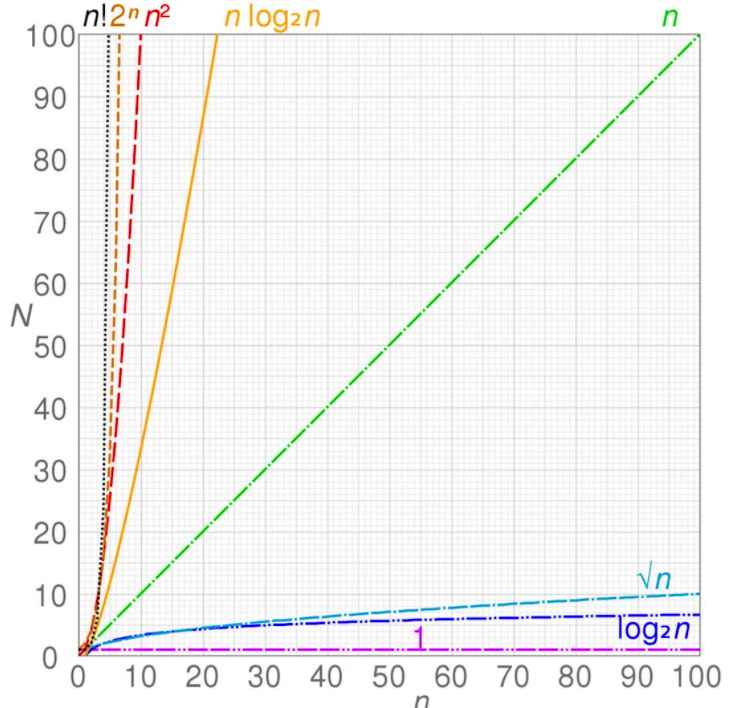

## 时间空间复杂度计算

### 时间复杂度

时间复杂度：用于定性描述算法的运行时间。


最重要的几个：n2 > n > log2n > 1

<mark>时间复杂度：主要看代码被执行了多少次</mark>

事件复杂度定性运行时间，用大 O 标识，比如 O(n)

```js
// O(1)
let i = 0；
i += 1
```

```js
// O(n)
for(let i = 0; i < n; i++){
  console.log(i)
}
```

O(1) + O(n) = O(n) 相加 只看最大的时间复杂度

```js
//O(1)
let i =0
i +=1

//O(n)
for(let j = 0; j < n; j+=1){
    console.log(j)
}
```

O(n) * O(n) = O(n^2) 相乘，取次方

```js
for(let i = 0; i < n; i++){
   for(let j = 0; j < n; j++ ){
     console.log(i, j)
   }
}
```

循环的次数是2的多少次方等于n? 所以就是log2的N次方
```js
// O(logN)
let i = 1;
while(i < n){
  console.log(i)
  i *= 2
}
```


先后排列：相加取最大
嵌套排列：相乘去计算
括号里的数字代表代码被执行多少次
O（logN）代表代码执行了logN次=>求2的多少次方时


### 空间复杂度

空格复杂度也用 大 O 

表示运行中临时占存储空间的大小

每一个基础类型的值为一个空间计算单元

```js
// O(1) // 因为只声明了单个变量
let i = 0;
i += 1
```

```js
// O(n) // 因为声明了数组，数组中占用了 n 个空间
const list = []
for(let i = 0; i< n; i++){
  list.push(i)
}
```

```js
// O(n^2) // 因为矩阵存储了多维的值
const matrix = []
for(let i = 0; i < n; i++){
  matrix.push([])
  for(let j = 0; j < n; j++){
    matrix[i].push(j) 
  }
}
```