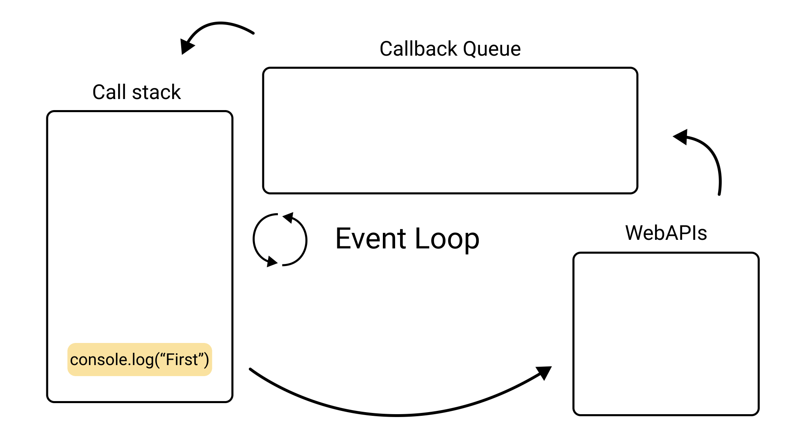
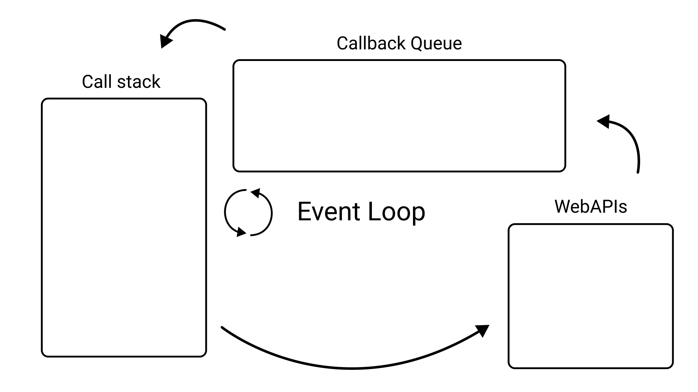
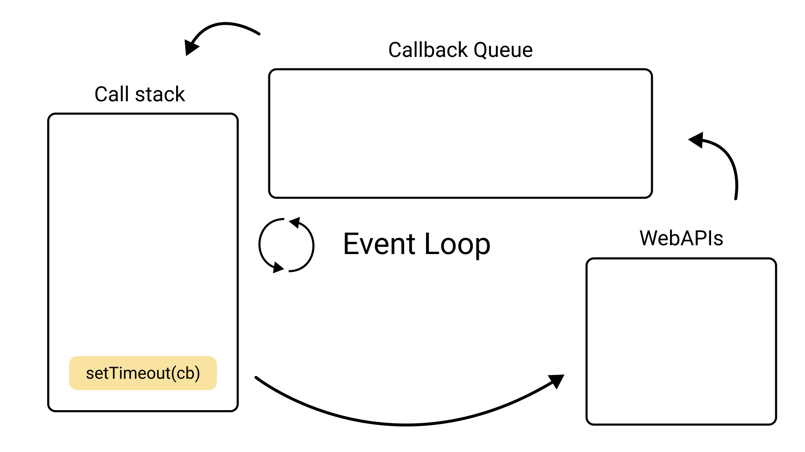
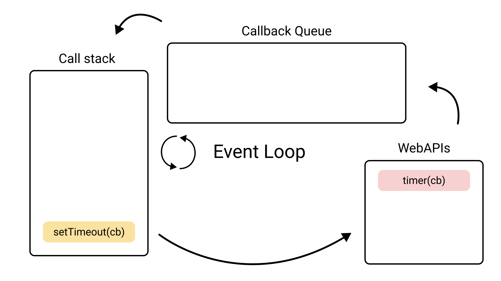
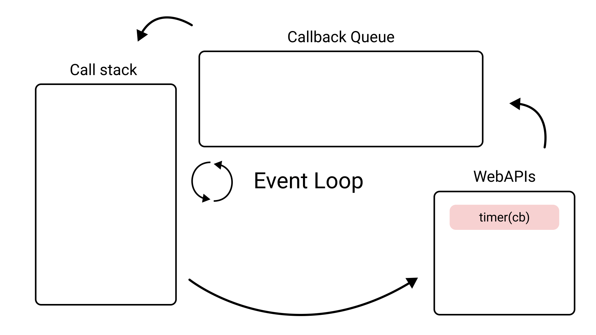
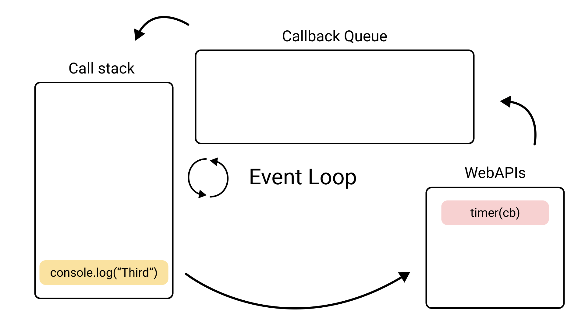
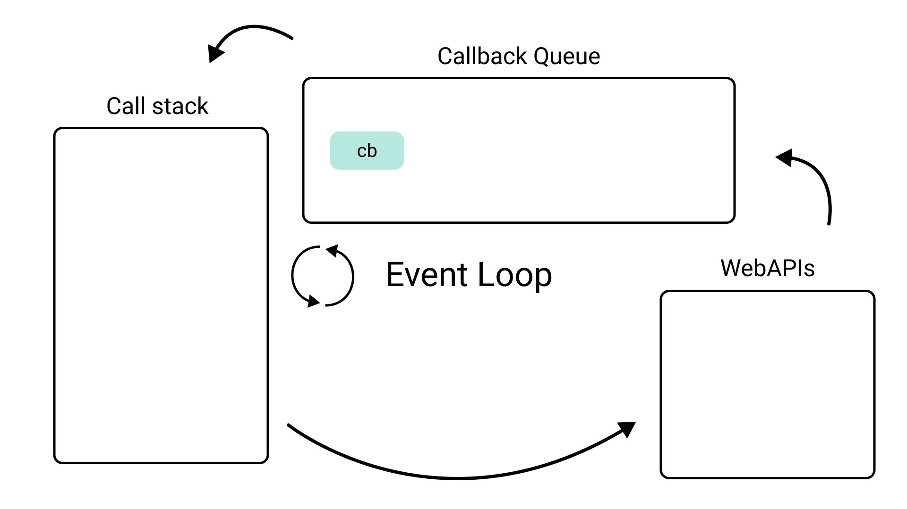
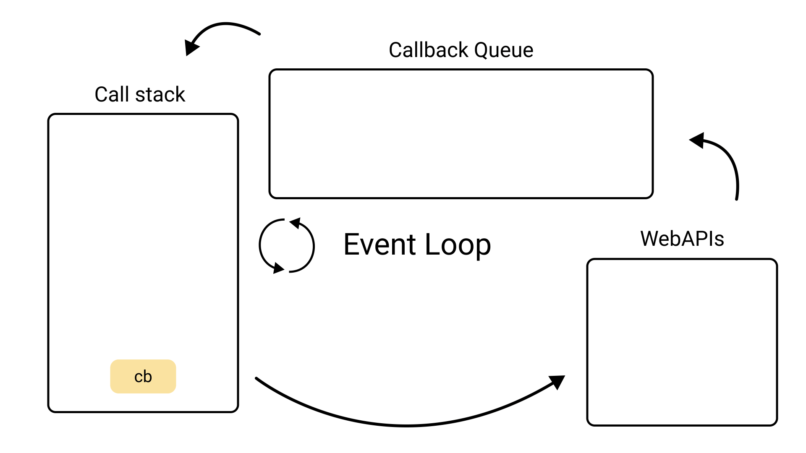
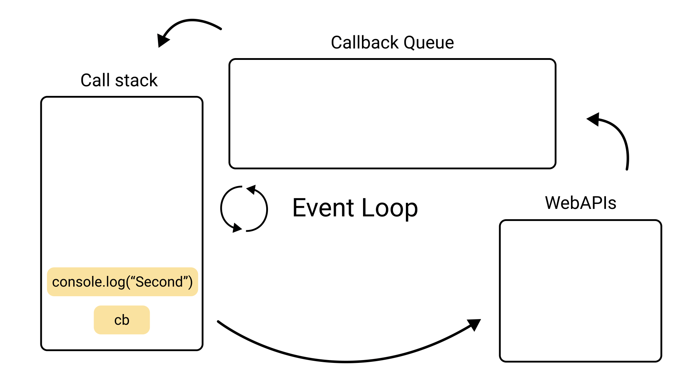

## 队列 && 异步事件循环
队列：先进先出「排队」

入队：push（放最后）

出队：shift（remove first element）

```js
const queue = [];

queue.push(1);//进入队列

queue.push(1);//进入队列

const item1 = queue.shift();//出队列

const item2 = queue.shift();//出队列

```

### 队列的使用场景：

一. JS异步中的任务队列
js是单线程的，无法同时处理异步的并发任务
1. 使用任务队列先后处理异步任务

二.计算最近请求次数（3000ms内）

```
//输入
inputs = [[],[1],[100],[3001],[3002]]
//输出
[null,1,2,3,3]
```

越早发出的请求，越早不在3000ms内的请求
1. 有新请求就入队，超过3000ms出队
[1][100][3001]入队,在[3002]入队时，由于[1]已经不在3000ms内了，因为3002-1 = 3001,所以[1]出队
2. 队列长度就是最近请求次数

### 事件循环与任务队列


首先理解三个概念 
1. call stack 
2. web APIs 
3. callback queue 

### 一. call stack（调用堆栈）
作为一种单线程语言,js只有一个调用堆栈，意味着一次只能执行一件事。

一旦某行代码被执行，就会被添加到堆栈中，一旦完成执行或者返回一个值，他就会从堆栈中删除

如上图 console.log被执行完了，就会从堆栈中删除


### 二. web api & callback queue
   
web api可以看作成帮助允许时提供额外的线程来执行耗时任务，这样call stack就不会堵塞

callback queue 

回调函数完成后从webapi中推送的队列

```js
console.log("First")

setTimeout(() => {
  console.log("Second")
}, 2000)

console.log("Third")
```
注意，setTimeout是浏览器提供的WebAPI。
这段代码如何执行？

1. console.log('first')会被执行，加入call stack 中



2. console.log("First")执行并从调用堆栈中移除



3. setTimeout()将被调用，并被添加到调用堆栈中。


4. setTimeout调用浏览器定时器，定时器被运行在浏览器定时线程


5. setTimeout执行完成后从call tack 移除


6. console.log("Third")被调用并添加到堆栈中。


7. 2s的定时器结束，回调函数被push到callback queue

当这个定时器执行完毕，webapi总是会push 回调函数到callback queue里




---
接下来进入到event loop
事件循环很简单，他要做的事情就是检查callstack中是否还有什么需要执行，如果没有，他会检查callback queue有什么东西

如果callback queue有东西，事件循环会将它push到call stack里，这个操作只有在call stack 为空的情况下

1. Callback通过事件循环添加到调用堆栈中


9. console.log("Second")被回调函数调用，它将被添加到堆栈中。


10. console.log("Second")被执行并从堆栈中移除。


11. 最后我们的回调函数也完成了并从堆栈中移除。


注意：虽然callstack是来自JS允许，但是webapi callstack queue,eventloop 都是浏览器提供的


