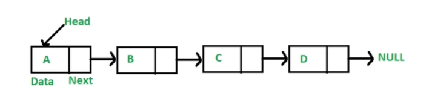

## 链表

### 链表是什么？

1. 多个元素组成的列表
2. 元素存储不连续，用next指针连在一起


### 数组 vs 链表

数组： 数组增删非首尾元素时候，往往需要移动元素

链表：增删非首尾元素，不需要移动元素，只需要更改next指向即可

### js 链表

js中没有链表，可以使用object模拟

```js
//创建四个object
const a = {val:'a'}
const b = {val:'b'}
const c = {val:'c'}
const d = {val:'d'}

//将他们连接起来
a.next = b
b.next = c
c.next = d

//遍历链表
let p = a //声明一个指针p
while(p){
    console.log(p.val)
    p = p.next
}

//插入值 在c,d之间
const e = {val:'e'}
c.next = e
e.next = d


//删除
c.next = d
```


