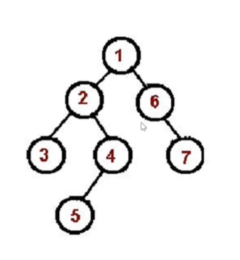
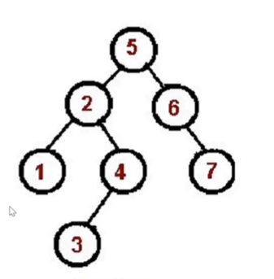
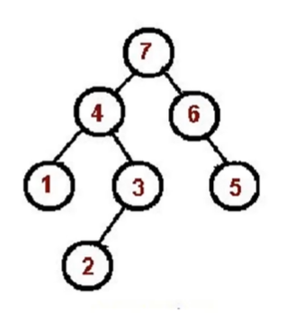

## 二叉树

二叉树：每个节点最多只有两个字节点

JS 中通常用 Object 来模拟二叉树
```js
const binaryTree = {
    val:1
    left:{
        val:2,
        left:null,
        right:null
    },
    right:{
        val:3,
        left:null,
        right:null
    }
}
```

## 先序遍历 (preorder)：根左右

1. 访问根节点
2. 对根节点的左子树进行先序遍历
3. 对根节点的右子树进行先序遍历

就记住：根左右 （他是先嘛，就根最前）



先遍历根节点1，然后左子树2。在遍历2的左子树3，在遍历2的右子树4，遍历4的左子树5.然后再遍历root右子树6,最后遍历6的右子树

```js
const preOrder =  ()=> {
    if(!root){return;}
    console.log(root.value);
    preOrder(root.left);
    preOrder(root.right);
}

```

//非递归版先序遍历

```js
const preorder = (root)=> {
    if(!root) {return;}
    const stack = [root];
    while(stack.length){
        const node =  stack.pop();
        console.log(node.val);
        if(node.right) stack.push(node.right);
        if(node.left) stack.push(node.left);   
        
    }  
}
```

## 中序遍历 （inorder）：左根右

1. 对根节点的左子树进行中序遍历

2. 访问根节点

3. 对根节点的右子树进行中序遍历



```js
const inorder = (root) => {
   if(!root) { return; } 
   inorder(root.left);
   console.log(root.val);
   inorder(node.right);
}
```


### 后序遍历算法（postorder）：「左右根」

 1: 对根节点的左子树进行后序遍历

 2: 对根节点的右子树进行后序遍历

 3: 访问根节点

 

 ```js

const postorder = root => {
    if(!root) return 
    postorder(root.left)
    postorder(root.right)
    console.log(root.val)
}
```
