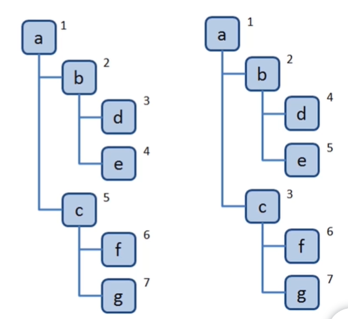

# 深度/广度 优先遍历

深度优先遍历：

先访问一个节点下的<mark>深层次的节点</mark> 【相当于一页一页看书】

广度优先遍历：

先横向遍历<mark>同级节点</mark>，再遍历下级的同级节点 
【相当于先看标题在看目录最后看内容】




## 深度优先遍历

深度优先遍历：

1. 访问根节点对根节点的 

2. children 挨个进行深度优先遍历

```js
const dfs = (root) => {
    //访问根节点
    console.log(root.val);
    
    //对children进行遍历,先拿到根节点的child，
    再调用dfs方法，把这个child当作根节点，
    再次调用
    root.children.forEach(child)=> 
    {dfs(child});
}
dfs(tree);
```

## 广度优先遍历

广度优先遍历
1. 将根节点入队
2. 队头出队，并且访问
3. 将它的children入队
4. 重复二三步骤，直到队列为空

```js
const bfs = (root)=> {
    const q = [root];
    while(q.length > 0) {
        const head = q.shift();
        console.log(head.val)
        head.children.forEach((child) => {
            q.push(child);
        })
    }
}

bfs(tree);
```