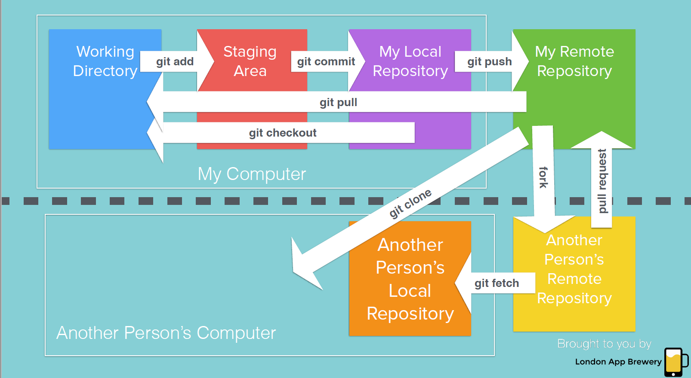

## 常用git 命令

- git add . 把所有修改后的文件添加到本地
- git checkout xxx 把xxx文件还原到未修改的状态
- git commit -m "xxx" 提交一行记录
- git push orign master 把提交的分支推送到远程服务端
- git branch 查看项目分支

- git checkout 文件名 撤销某个文件的修改
- git checkout . 撤销所有文件修改
- git checkout xxx 切换xxx分支
- git checkout -b XXX 创建一个新分支XXX

- git merge xxx 把xxx分支合并到主分支
- git diff 查看全部更改的内容(新增的文件不在内)
- git fetch 获取远程仓库内容。使用fech获取时，并未合并到本地仓库.此时可使用git merge实现远程仓库副本与本地仓库的合并
- git pull origin master 可为git fetch + git merge 


## git merge git rebase区别

###  git merge
使用git merge 命令将 master 分支合并到 feature分支中：

```
git checkout feature
git merge master
```


git merge 在feature中新增一个merge commit，将两个分支联系到一起

好处：非破坏性的，对现有分支不会更改
缺点：每一次合并上游更改时，会产生额外的合并


### git rebase

本质是变基，变基是什么？公共祖先
使用git rebase 命令将 master 分支合并到 feature分支中：
```
git checkout feature
git rebase master
```


rebase会将feature分支移动到master的顶端

与merge不同的是，rebase 通过为原始分支中的每个提交创建全新的 commits 来重写项目历史记录,特点是仍然会在feature分支上形成线性提交

好处：清晰的历史

git rebase 黄金原则：
不能再一个共享分支上进行Git rebase操作 git 会认为你的主分支的历史与其他人的有分歧


