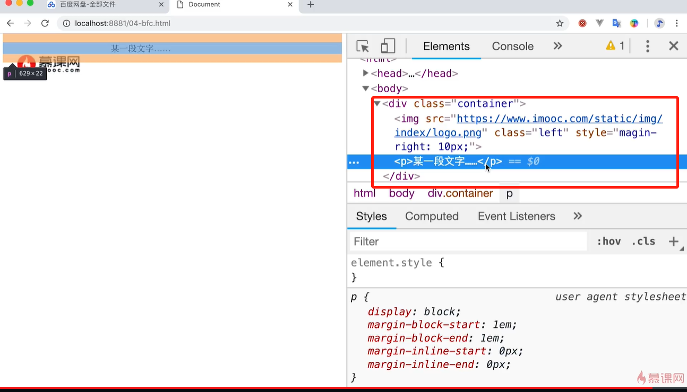
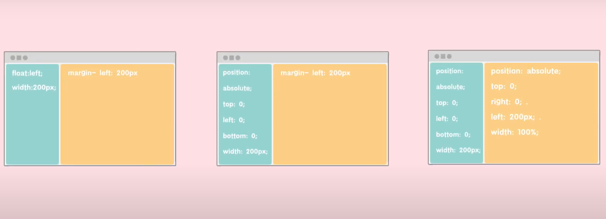
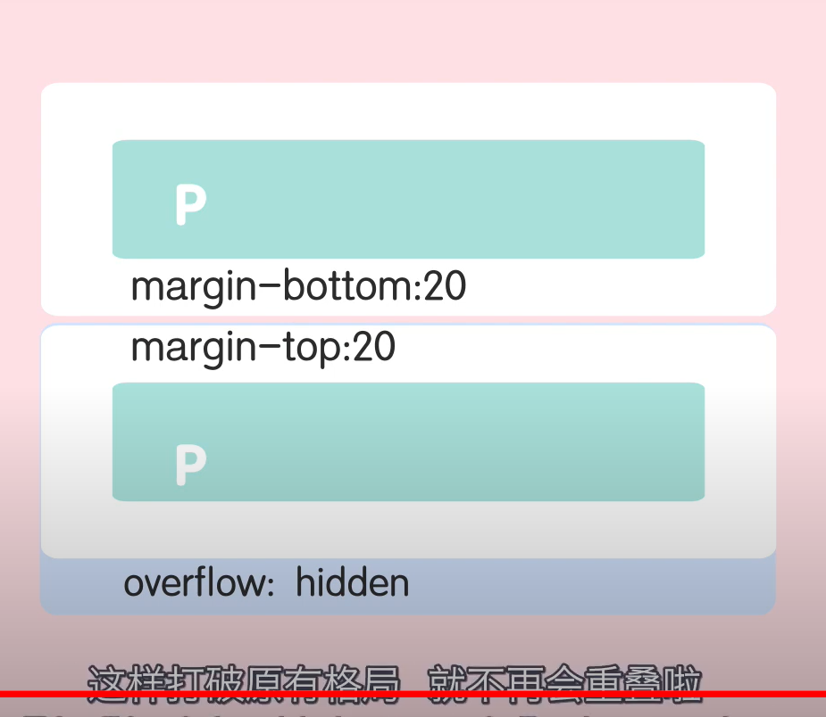

## 什么是BFC

Block format context,块级格式化上下文
形成一个独立的空间，让空间内的子元素不会影响到外面的布局



这幅图可以看出，这个container虽然包裹着images和text，但是Images没有把container撑开，原因是images写了float:left

### 触发BFC常见条件：

1. float 不是none
2. position 是absolute 或者 fixed
3. overflow不是visible
4. display是flex inline-block等

### 触发BFC解决问题

1. 浮动元素的父元素高度坍塌
2. 两栏自适应布局
3. 外边距垂直方向重合





清除浮动 overflow:hidden


```html
 <div class="container bfc">
        
        <p>这是一段文字</p>
     </div> 
     
     <style>
       .container{background-color: #ccc;border: 1px solid red;}
       .left{float: left;}
       img{margin-right: 10px;}
       .bfc{overflow: hidden;} /*触发元素的BFC*/
    </style>
```


如果这个容器没有BFC，图片脱离文档流，跑出容器控制范围内的
如果容器加了BFC，这个即便浮动了也不会跑出去，而是会把容器撑大


但是如果子元素脱离文档流是因为absolute或者fixed，则开启BFC同样不管用，这种情况下，css没法解决，只能使用JS获取元素高度然后赋值给父元素解决

```html
<body>
        <div class="container" id="container">
            <div class="box" id="box" ></div>
        </div>

        <script>
            //拿到子元素的高度
            var box=document.getElementById("box").offsetHeight;
            //将子元素的高度赋予父元素
            document.getElementById("container").style.height=box;
        </script>


         <style>
            .container{
                width: 300px;
                height: auto;
                background: rgb(54, 181, 219);
		        position: relative;
            }
            .box{
                width: 200px;
                height: 200px;
                border: 2px solid rgb(247, 129, 129);
            }
        </style>
]
</body>
```

