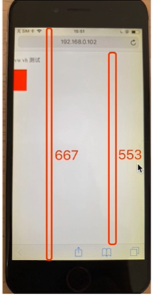

## CSS响应式

1. rem是什么？
2. 响应式布局常见方案
3. rem的弊端
4. 网页视口尺寸
5. vw/vh

### Rem

rem是一个长度单位

1. px,是绝对长度单位，在任何情况下都是一样的 常用
2. em， 相对长度单位，相对于父元素 不常用
3. rem, 相对长度单位，相对于根元素，常用于响应式布局


定义rem，通过html定义
```html
   <style>
        html {
            font-size: 100px;
        }
        div {
            background-color: #ccc;
            margin-top: 10px;
            font-size: 0.16rem;
        }
    </style>
```

### 响应式布局常用方案

1. media-query，根据不同的屏幕宽度设置根元素font-size。
2. rem，基于根元素相对单位


```css
@media only screen and (min-width:375px) and (max-width:413px){
    /* iphone6/7/8 和 iphone x */
            html {
                font-size: 100px;
            }
}
```

### rem 弊端：阶梯型
他只能对这一个范围内的font-size大小进行调整，不能对每个不同的宽度进行调整

### 网页视口尺寸
1. window.screen.height //屏幕高度
2. window.innerHeight  //网页视口高度 浏览器可以显示内容的高度 不含工具条和搜索框
3. document.body.clientHeight //body高度

宽度同理，将height改成width



如上图可知：window.screen.height = 667, window.innerHeight =553, document.body.clientHeight 是左侧红色方块高度


## vh vw
1. vh网页视口高度的 1/100
2. vw网页视口宽度的 1/100
3. vmax 取 vh vw的最大值， vmin 取 vh vw的最小值
