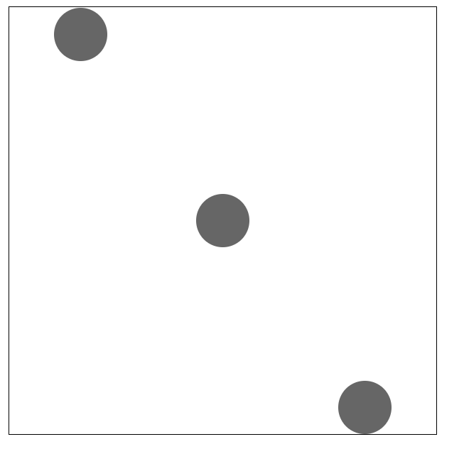

## Flex布局

常用语法回顾：
1. flex-direction 属性决定主轴的方向
   
 row | row-reverse | column | column-reverse

2. justify-content 对齐方式

flex-start | flex-end | center | space-between | space around

3. align-items 定义项目在交叉轴如何对齐

flex-start | flex-end | center | stretch

4. flex-wrap 换行

nowrap | wrap | wrap-reverse

5. align-self 

| flex-start | flex-end | center | baseline | stretch


### 实现色子



```html
<style>
        .container{
            width:400px;
            height:400px;
            border:1px solid #000;
            display:flex;
            justify-content:space-around;
        }
        .item{
            width:50px;
            height:50px;
            border-radius: 50%;
            background-color: #666;
        }
        .item2{
            align-self: center;
        }

        .item3{
            align-self:flex-end
        }

    </style>
</head>
<body>
    <div class = "container">
        <div class = "item item1"></div>
        <div class = "item item2"></div>
        <div class = "item item3"></div>
    </div>
```
   

