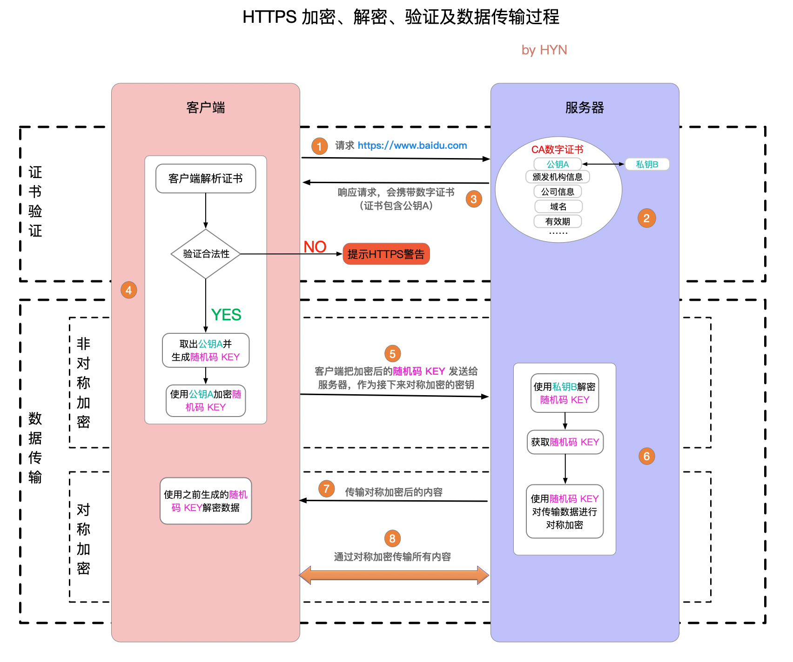

# HTTP 加密

HTTP与HTTPS区别

- http明文传输，敏感信息容易被劫持
- https = http + 加密, 劫持了也无法解密

加密方式：

- 对称加密： 利用同一个key加密
  
- 非对称加密： 一对key（public key, private key)
客户端向服务端请求时，服务器将public key传给客户端，客户端传输内容通过public key加密后，传给服务器。
服务器用private key解密。
就算public key被劫持也不怕，因为private key存储在服务器端时安全的，解密需要private key

https同时用到了这两种加密方式

先

## https 数据传输过程（使用加密）

`证书验证`
1. 请求网址
2. 服务器拿到证书 会产生public keyA private keyB 私钥由服务端自己保存，不可泄漏。公钥则是附带在证书的信息中，可以公开的
3. 服务器把证书给客户端，客户端解析证书，验证合法性 如果证书不是可信机构颁布，或者证书中的域名与实际域名不一致，或者证书已经过期，就会向访问者显示一个警告

`数据传输` 

-》 进入非对称加密
1. 客户端就会从服务器证书中取出服务器的public key A。然后客户端还会生成一个随机码 KEY，并使用public key A将其加密
2. 客户端把加密后的随机码 KEY 发送给服务器
3. 服务器用private key 解密随机key

经过以上这些步骤，客户端和服务器终于建立了安全连接，完美解决了对称加密的密钥泄露问题，接下来就可以用对称加密愉快地进行通信了。

-》对称加密
服务器使用密钥 (随机码 KEY)对数据进行对称加密并发送给客户端，客户端使用相同的密钥 (随机码 KEY)解密数据。

为什么使用证书？
因为仅仅使用非对称加密+对称加密 会出现中间人攻击的情况
比如说服务器发出公钥A给客户端，但是公钥A数据被中间人劫持了，中间人把自己的公钥B给了客户端。客户端利用公钥B进行数据加密，加密后的数据被中间人获得后，利用自己的私钥B进行解密获得用户数据，然后使用自己劫持到的公钥A进行加密，并发送给服务器，服务器获取到数据后利用私钥A解密，并生成对称加密使用的密码，并将它发送给中间人。这样中间人就可以在C/S两方不知情的情况下获取到了密码