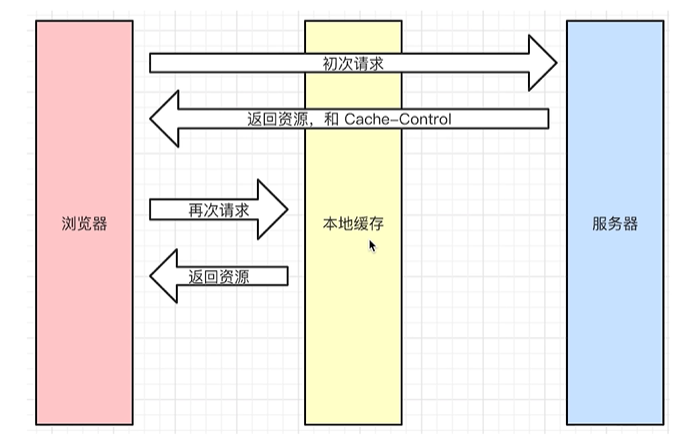
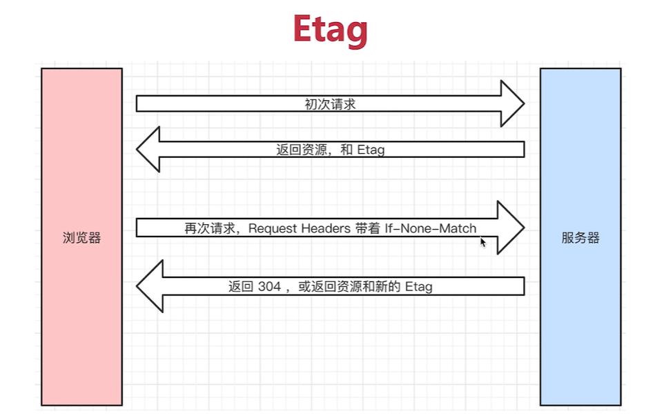
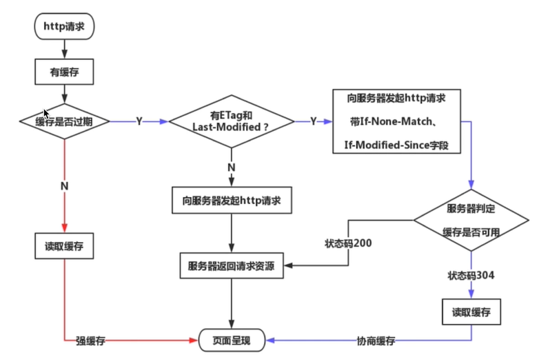

# HTTP相关知识点

1. Http状态码
2. HTTP Methods
3. HTTP　headers
4. HTTP 缓存

## http 状态码

状态码分类

- 1xx 服务器收到请求
- 2xx 请求成功 
- 3xx 重定向

`301` 永久重定向（配合location, 浏览器自动处理）Eg:域名过期，老的永远不会用了

`302` 临时重定向 （配合location, 浏览器自动处理）Eg: 只是这次访问这个老地址，等待返回302告诉location 去访问这个新的location，下次他还会这样
Eg: 百度搜索然后点击link进去，会先有一个baidulink 然后再跳转到那个主页

`304` 资源未修改： 直接使用浏览器访问该网址时的缓存资源

- 4xx 客户端错误
`404` 资源未找到
`403` 没有权限

- 5xx 服务端错误

`500` 服务器错误
`504` 网关超时

---

## HTTP Methods

`传统API设计`：把每个url 当作一个功能

- get 获取服务器数据
- post 向服务器提交数据

get api/get-blogs?id=100

post api/create-blog

post api/update-blog?id=100

`restful API` 把每个url 当作一个资源

- get 获取数据
- post 新建数据
- patch put 更新数据
- delete 删除数据

如何设计成一个资源呢？
1. 尽量不用url参数
   
传统API：api/get-blogs?id=100

restful API: /api/blogs/2

2. 用method表示操作类型
   
传统API：api/get-blogs?id=100

restful API: 

post请求 /api/blogs
patch 请求 /api/blogs/100
get请求 api/blog/100

---

## HTTP　headers

### Request Headers

- Accept 浏览器可接受的数据格式
- AcceptEncoding 浏览器可接受的压缩算法
- AcceptLanguage 浏览器可接受语言
- connection: keep-alive 一次TCP连接重复使用
- cookie
- Host
- User-Agent: 浏览器信息
- ContentType：发数据格式

### Response Headers
- content-type: 返回数据格式
- content-length: 返回数据大小
- content-encoding:返回数据的压缩算法
- set-cookie:更改cookie

### 缓存headers

- cache-control
- expires
- last-Modified
- If-Modified-since
- Etag
- if-None-Match

--- 

## HTTP 缓存

- 什么是缓存？
把一些不需要重新获取的东西保存起来

- 为什么需要缓存？ 
减少网络请求的数量可以让页面加载的更快

- 哪些资源可以被缓存？

js css img

### 强制缓存 catch-control

cache-control 哪些文件可以缓存，需要服务器端控制

第一次请求：服务器会返回资源，和cache-control
第二次请求：判断cache-control 的max-age是否过期，没过期，会在本地缓存寻找，在返回资源

catch-control的值

- max-age: 缓存的最长时间（秒）
- no-cache:不用本地缓存
- no-store: 不用本地缓存 也不用服务端缓存
- private: 只允许最终用户做缓存
- public： 用户和中间代理都能缓存

关于expires 已经被cache-control代替

---
## 协商缓存

什么是协商缓存，协商缓存是：服务器判断客户端的本地资源是否和服务器端一样，如果一样则返回304，否则返回200 + 最新资源

用什么依据去判断他们是否一样呢？可以使用资源标识
资源标识在response header中有两种
1. last-modified 资源的最后修改时间
2. Etag 资源的唯一标识

### 如何使用？

第一次请求：返回资源和last-modified

第二次请求：request header 带着 if-modified-since 请求服务器，服务器判断资源最后修改时间是不是你带的这个

如果是：返回304
不是： 返回资源 + 新的last-modified

### Etag 和 Last-Modified 区别

优先使用Etag

Last-Modified 只能精确到毫秒级

如果资源重复生成，而内容不变，则Etag更精准

---
### 缓存总结（重要！）

`图中强制缓存和协商缓存的区别：`

1.强制缓存是由`浏览器控制`，浏览器不会像服务器发送任何请求，直接从本地缓存中读取文件并返回Status Code: 200 OK

2.协商缓存是由`服务器控制` 向服务器发送请求，服务器会根据这个请求的request header的一些参数来判断是否命中协商缓存，如果命中，则返回304状态码并带上新的response header通知浏览器从缓存中读取资源；

`强制缓存`时根据`过期时间`使用，`协商缓存`根据文件是否`有没有修改`来使用. 如果过期了，就需要使用协商缓存来确定文件有没有修改，如果修改就需要服务器返回修改后的资源 没有修改就还是可以使用缓存的资源。

## 刷新对缓存的影响

    正常操作：地址栏输入url，跳转链接，前进后退等（强制缓存有效，协商缓存有效）

    手动刷新：F5，点击刷新按钮，右击菜单刷新（强制缓存失效，协商缓存有效）

    强制刷新：ctrl+F5（windows） shift+command+r（mac）（强制缓存失效，协商缓存失效）

