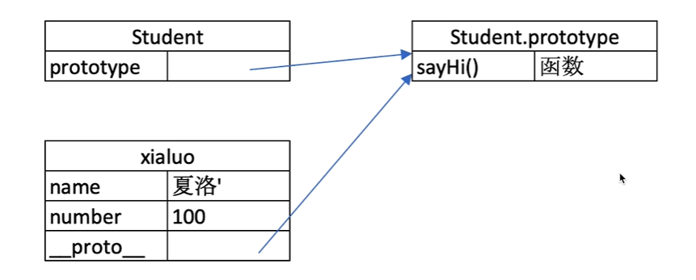

## Js原型 && 原型链


### 隐式原型 显示原型
1. 每个class都有一个prototype （显示原型）
2. 每个实例都有__proto__（隐式原型）
3. 实例的__proto__指向对应class的prototype


### 基于原型的执行规则
获取属性或者方法时候：
1. 先在自身属性和方法寻找
2. 找不到自动去__proto__寻找

比如：
1. 想找name就在xialuo的属性中寻找，就找到了
2. 想找sayHi,在属性中找不到就去__proto__（隐式原型）寻找，隐式原型指向class的prototype(显示原型)，也就找到了


案例分析： 定义Student class

```js
typeof People // 'function'
typeof Student //'function'

console.log(student1.__proto__) // People{constructor:f, methods:f}
console.log(student1.prototype) // People{constructor:f, methods:f}
console.log(student1.__proto__ === student1.prototype)  //true
```
发现student1.__proto__ = student1.prototype，这是为什么呢？
就是我上面说的那三句话，实例的__proto__都对应指向class的prototype




### 原型链

解释原型链需要用继承来体现了
定义一个People的class,同时Student class继承于people

people属性是：name, eat()
student里属性是number, sayHi()


当调用xialuo.eat()时候，会现在自己的属性找，找不到找__proto__对应的Student.prototype,找到就调用，如果还找不到，就会通过student.prototype的__proto__(隐式原型) 对应的people的prototype查找。


那xialuo instanceof Student的工作原理

就是xialuo的隐式原型一点点往上爬能不能对应到class的显示原型


