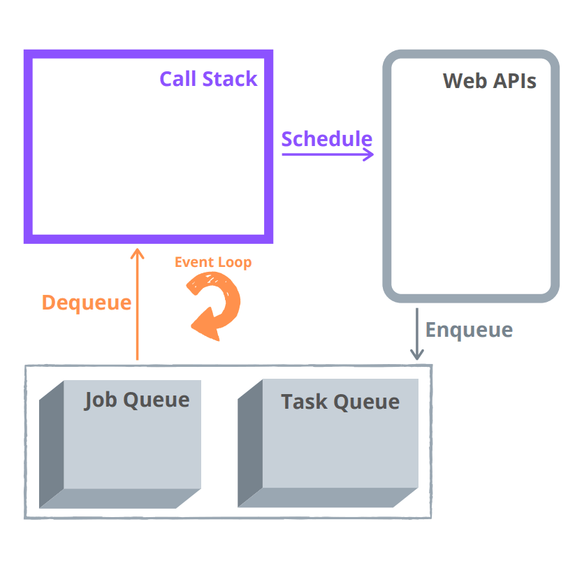
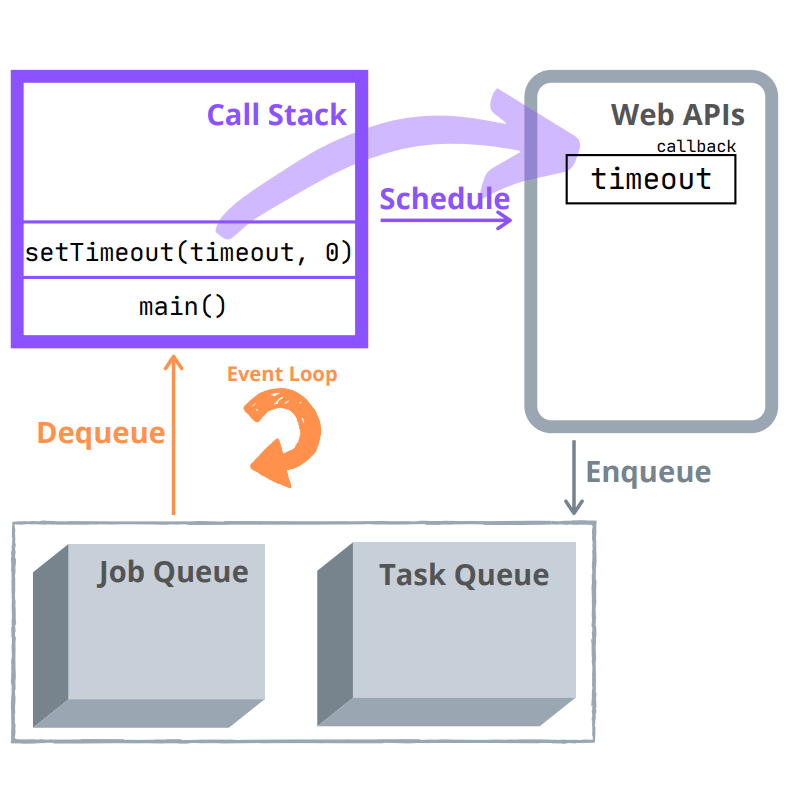
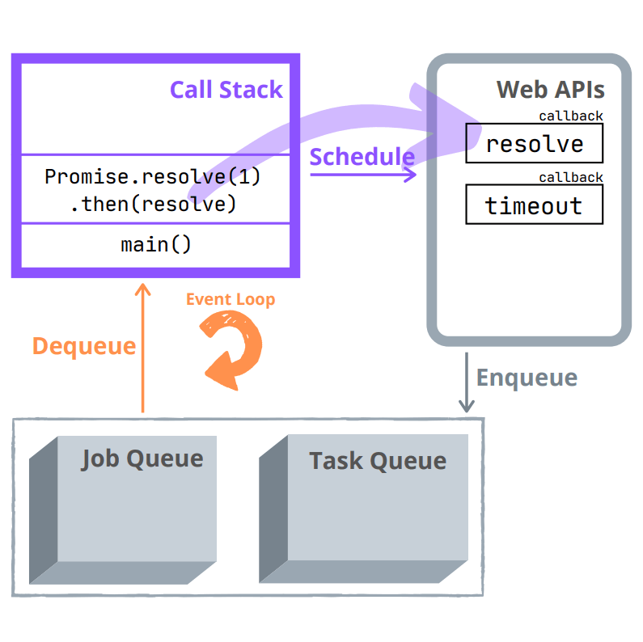
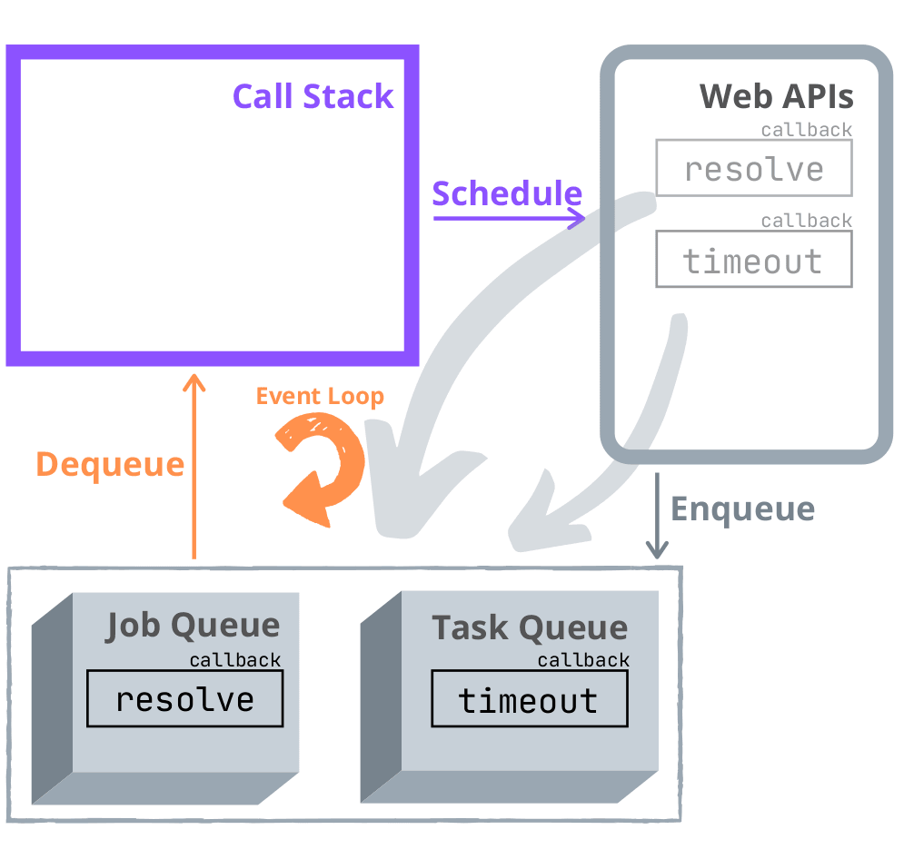
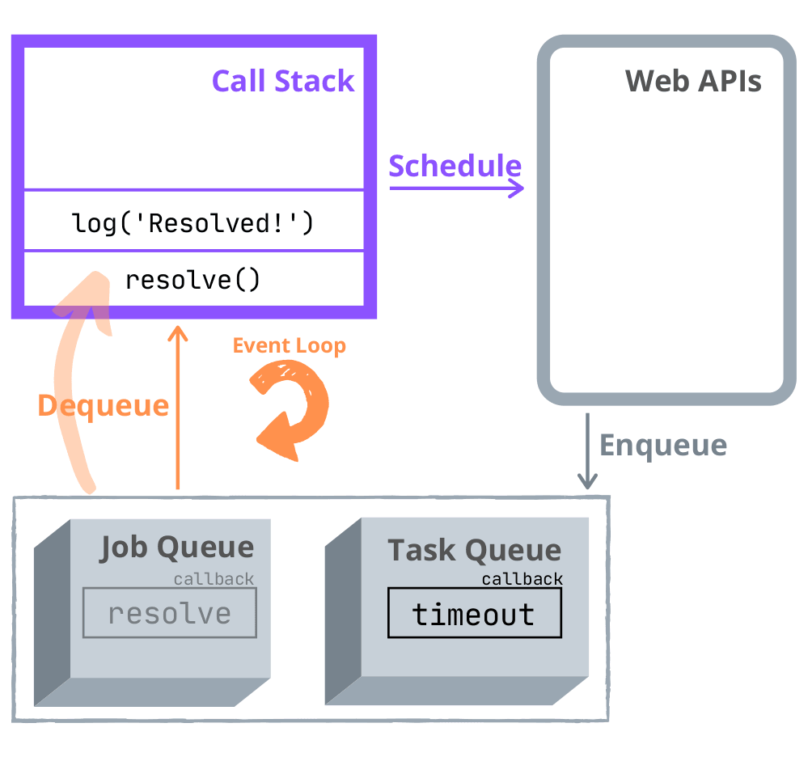
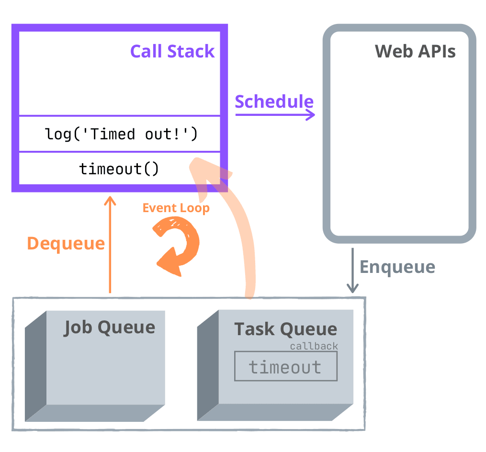

# 为什么Promise比setTimeOut()执行快？

```js
Promise.resolve(1).then(function resolve() {
    console.log('Resolved')
})

setTimeout(function timeout(){
    console.log('Time Out!)
})
// logs 'Resolved!'
// logs 'Timed out!'
```

promise. resolve(1)是一个静态函数，它返回一个立即解析。setTimeout(callback, 0)以0毫秒的延迟执行回调。

那为什么说promise快呢？会不会上述代码是因为promise写在setTimeout前面了？

```js
setTimeout(function timeout() {
  console.log('Timed out!');
}, 0);
Promise.resolve(1).then(function resolve() {
  console.log('Resolved!');
});
// logs 'Resolved!'
// logs 'Timed out!'
```
那这样的结果还和前面一样，这是为什么呢？


## Event Loop

看下面的图，让我们回顾一下异步JavaScript如何工作的主要组件。



`callStack`:（后进先出）存储代码执行期间的上下文

`Web api`:可以看作成提供额外的线程来执行耗时任务 异步操作（fetch requests, promises, timers）

`task Queue`(也被命名为宏任务):（先进先出）该结构保存准备执行的 callback of async operations。

例如，一个超时的setTimeout()的回调-准备被执行-在任务队列中排队。

`job Queue`(微任务): (先进先出) 保存的是准备执行的callbacks of promises.例如一个fulfilled promise

`event loop`: 永久监视callstack是否为空，如果为空，则查看job queue, task queue,并将准备执行的从堆栈种取出


接着回顾一下 什么是宏任务，什么是微任务？ 
宏任务： setTimeout setInterval Ajax, DOM 
微任务：promise async/await


## Job Queue VS task Queue

```js
setTimeout(function timeout() {
  console.log('Timed out!');
}, 0);

Promise.resolve(1).then(function resolve() {
  console.log('Resolved!');
});
```


A) 调用setTimeout，timeout() callback 会被存在webAPI 里，然后移除callstack的setTimeout

```
setTimeout(function timeout() {
  console.log('Timed out!');
}, 0);

执行这些
```



B) call stack执行promise.resolve(true).then(resolve),和将resolve()存入web apis

```
Promise.resolve(1).then(function resolve() {
  console.log('Resolved!');
});
执行这些
```




C) promise立即被解析，timer也会立即被解析。因此timer callback timeout()将会排入task queue,promise callback resolve()排入job queue




D) 这时call stack 已经空了，`会先尝试进行DOM渲染，有的话，先渲染，再去触发event loop`


E) 现在是有趣的一个part,`event loop的优先级是job比task要高`，所以会先将promise的call back resolve(),从队列种取出，将它放入call stack里。然后执行
```
Promise.resolve(1).then(function resolve() {
  console.log('Resolved!'); //执行这句话
});
```



F) 最后event loop 将timeout()从task queue取出放入call stack执行

```
setTimeout(function timeout() {
  console.log('Timed out!'); //执行这句话
}, 0);
```



# 总结
为什么Promise比setTimeOut()执行快？

因为event loop的优先级的存在，将job queue（stores fulfilled promises' callbacks） 比 task queue(stores timed out setTimeout() callbacks)高


那问题来了，为什么优先级会更高呢？
这就需要注意的是，每次call stack清空后，都会触发 DOM 渲染，然后再进行 event loop


## 宏任务和微任务的区别

- 宏任务：DOM 渲染后再触发
- 微任务：DOM 渲染前会触发


```js
// 修改 DOM
const $p1 = $('<p>一段文字</p>')
const $p2 = $('<p>一段文字</p>')
const $p3 = $('<p>一段文字</p>')
$('#container')
    .append($p1)
    .append($p2)
    .append($p3)

// // 微任务：渲染之前执行（DOM 结构已更新）
// Promise.resolve().then(() => {
//     const length = $('#container').children().length
//     alert(`micro task ${length}`)
// })

// 宏任务：渲染之后执行（DOM 结构已更新）
setTimeout(() => {
    const length = $('#container').children().length
    alert(`macro task ${length}`)
})
```

微任务 -> 渲染 -> eventloop -> 宏任务

再深入思考一下：为何两者会有以上区别，一个在渲染前，一个在渲染后？

- 微任务：ES 语法标准之内，JS 引擎来统一处理。即，不用浏览器有任何关于，即可一次性处理完，更快更及时。
- 宏任务：ES 语法没有，JS 引擎不处理，浏览器（或 nodejs）干预处理。
