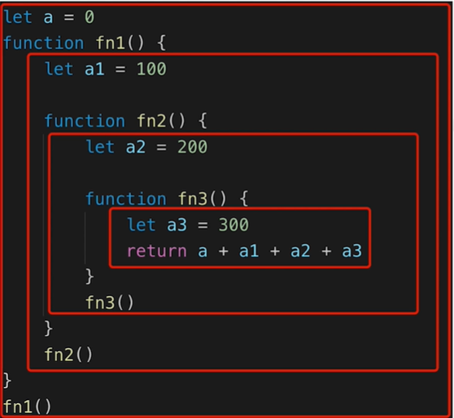

## 作用域闭包
1. 作用域和自由变量
2. 闭包
3. this

### 作用域
作用域：变量的合法使用范围


全局作用域：在全局可以使用 
函数作用域：只能在函数块中使用
块级作用域（ES6新增）：let，const定义的变量,在for if while{}内部使用

图中a为全局作用域，a1,a2,a3为函数作用域.

```js
//块级作用域
if(true){
    let a = 'a';
}
console.log(a)//报错
```

### 自由变量
1.一个变量在当前作用域没有定义，但被使用了
2.向上级作用域一层一层的找，直到找到为止
3.如果到了全级作用域没找到，就会报错not defined

比如上图的return a+a1+a2+a3, a,a1,a2,为自由变量，a3不是因为他在当前作用域被定义了


### 闭包

内部的函数存在外部作用域的引用就会导致闭包。

```js
var a = 0
function foo(){
    var b =14
    function fo(){
        console.log(a, b)
    }
    fo()
}
foo()
```
这里的子函数fo,存在外部的作用域a,b，就会产生闭包

闭包的表现形式：

1. 函数作为参数被传递 
2. 函数作为返回值被返回

<mark> 所有自由变量的查找 ，都是函数定义的地方，向上级作用域查找 ，而不是函数执行的地方！</mark>

```js
//function作为返回值

function create() {
    const a = 100 //走到这里，所以a=100
    return function(){
        console.log(a) //函数定义的地方,就是这里！往上走
    }
}
const fn = create()
const a = 200
fn() //100 

```

```js
//function作为参数被传递
function print(fn){
    const a = 200
    fn()
}
const a = 100
function fn(){
    console.log(a)
}
print(fn) //100
```


### 闭包在实际中运用

隐藏数据,只提供API

```js
function createCache(){
    const data = {}
    return{
        get: function
        set: function
    }
}

const c = createCache()
c.set('a',100)

```
data只是在createCache里的，只能使用方法去get set，只提供api,不直接提供数据


闭包可以用在许多地方。它的最大用处有两个，一个是前面提到的可以读取函数内部的变量，另一个就是让这些变量的值始终保持在内存中。

```js
function f1(){
    var n = 999;
    nAdd=function(){
        n+=1
    }
    function f2(){
        alert(n)
    }
    return f2;
}

var result = f1();
result(); //999
nAdd();
result(); //1000
```

这道题result是闭包f2函数，第一次是999,第二次是1000证明了函数f1中的局部变量n一直保存在内存中，并没有在f1调用后清除。
原因是f1是f2的父函数，f2被赋值了一个全局变量，这导致f2始终在内存里，而f2依赖f1,所以f1也在内存里，不会再调用之后被垃圾回收。


闭包难题
这道题多绕绕，两个参考网站：
https://blog.csdn.net/FE_dev/article/details/74124373
https://juejin.cn/post/6976992305827807263

```js
 function fun(n, o) {    
    console.log(o); 
    return {
        fun: function (m) {
            return fun(m, n); 
        }
    };
}

var a = fun(0); a.fun(1); a.fun(2); a.fun(3); // undefined,0,0,0
var b = fun(0).fun(1).fun(2).fun(3); // undefined,0,1,2
var c = fun(0).fun(1); c.fun(2); c.fun(3); // undefined,0,1,1
```

fun:function是匿名函数，类似于var fun = function()写法。它当中的return fun(m,n),通过匿名函数声明的方式，得到的return值不能自己调用自己，所以调用的是上一层的fun


