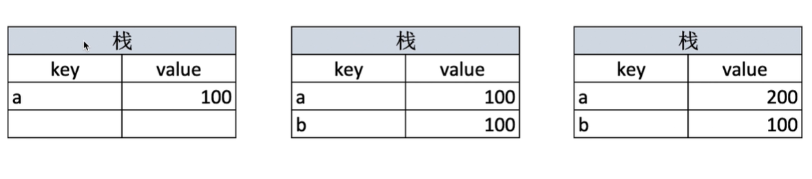
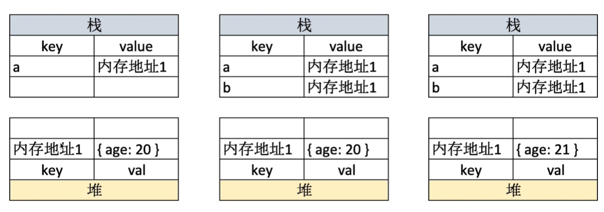

## 值类型 引用类型

值类型的值直接存储在栈中，各不相关
引用类型的值存储的是一个内存地址，这个内存地址指向于那个对象（堆中）

### 值类型

值类型的值直接存储在栈中，各不相关

常见的值类型
```js
let a //undefined
const b = 'b' //string
const c = 1 //number
const d = true //boolean
const e = Symbol('s') //symbol
```


```js
//值类型
let a = 100
let b = a
a=200
console.log(b) //100
```



### 引用类型

常见的引用类型
```js
const obj = {age: 20} // obj
const arr = ['a','b'] // array
const n = null //特殊引用类型，指针指向空地址
function fn() {} //特殊引用类型，所以没有‘拷贝 负值函数’
```


引用类型的值存储的是一个内存地址，这个内存地址指向于那个对象（在堆中）
```js
let a = {age:20}
let b = a
b.age = 21
console.log(a.age) //21
```




这两种存储类型的原因？
考虑到 内存空间和cpu耗时
值类型占用空间少 -> 可以直接放在栈里
引用类型 比如json占用空间大


## typeof 判断类型

1. 识别所有值类型

```js
let a                       type of a //undefined
const str = 'abc'           type of str //string
const num = 123             type of num //number
const b = true              type of b //boolean
const s = Symbol('s')       type of s //Symbol
```

2. 识别引用类型为object
```js
typeof  null //'object'
typeof  ['a','b'] //'object'
typeof  {x:10} //'object'
```

3. 判断函数
```js
typeof  console.log //'function'
typeof function(){}//'function'
```
