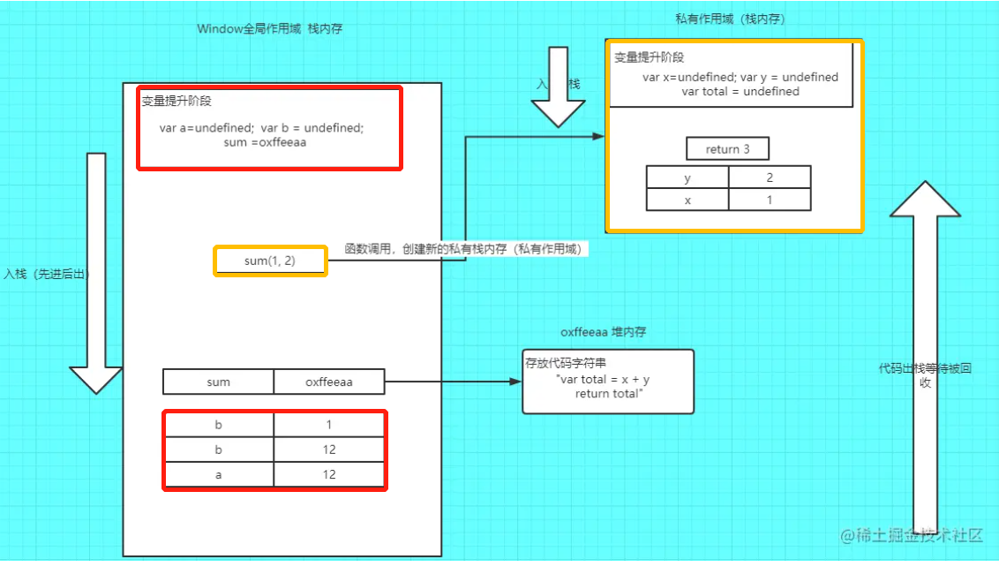

## 变量提升

什么是变量提升

变量提升是当栈内存作用域形成时，JS代码执行前，浏览器会将带有var,function关键字的变量提前进行声明（值默认就是undefined).define就是赋值操作。

变量提升阶段：
var:声明
function：声明定义

```js
/* 你应该见过下面的类似代码，那你知道这是为什么*/
console.log(a)  // undefined
var a = 10
```

所以上述代码带var会提前声明，那a就会被定义为undefined.

### 一. 变量提升讲解实例
```js
var a =12
var b = a
b = 1
function sum(x, y) {
    var total = x + y
    return total
}
sum(1, 2)
```

变量提升只发生当前作用域。


### 二.带var不带var区别
1. 全局作用域： 
带var声明变量会映射到window成为属性，
不带var相当于给window设置一个属性


1. 函数作用域：
 带var就是私有变量，
 不带var会向上级作用域查找，如果上级没有，就一直查到window为止

 ```js
 a=12 //没有带var，相当于给window设置属性
 console.log(a) //12
 console.log(window.a)

 var a=b=12 //这里b是不带var的
 /*相当于*/
 var a = 12
 b = 12
 ```

### 三.变量提升
 只有声明了变量被提升，只是定义不会被提升

 例子1：初始化不会被提升
 ```js
 console.log(num);
 var num
 num = 6
 ```
 编译后：
 ```js
 var num;
 console.log(num)//undefined
 num = 6 //初始化不会被提升
 ```

例子2：提升了var
 ```js
 num=6;
 console.log(num); //6 ->提升了var
 var num;
 ```
 编译后：
 ```js
 var num 
 num = 6
 console.log(num)
 ```


例子3：只是提升声明，定义位置不变
```js
console.log(num);
var num = 6
```

编译后：
```js
var num
console.log(num);//undefined
num = 6;
```

例子4： 

```js
function test() {
  if (!foo) {
    var foo = 5;
  }
  console.log(foo); 
}

test();
```

编译后：
```js
function test(){
    var foo //将if语句内声明提升
    if(!foo){
        foo = 5
    }
    console.log(foo) //5
}

test()
```

 ### 四.函数提升

1. 函数声明和初始化都会被提升
2. 函数表达式不会被提升
3. if中（）函数不会被提升
4. 判断条件是成立的才会对条件内的函数赋值，不成立不会被赋值


 例子1：函数声明被提升
 ```js
 console.log(test(5))

 function test(n){
     return n*n
 }
 ```

 预编译后：
 ```js
 function test
 console.log(test(5)) //25
 ```

 例子2： 函数表达式不会被提升

 ```js
 console.log(test) 
 console.log(test(5))
 var test = function(n){
     return n*n
 }
 ```

 预编译后：
 ```js
 var test
 console.log(test)//undefined
 console.log(test(5)) //报错test is not function
 test = function()
 ```

 例子3：

 ```js
 var y = 1
if(function f(){}){ 
    console.log(typeof f)  // undefined
    y = y + typeof f
}
console.log(y)  // 1undefined
 ```
判断的条件没有提升，所以条件内部的 f 是未定义


例子4：判断条件是成立的才会对条件内的函数赋值
```js
console.log(a)
console.log(p())
if(true){
    var a = 12
    function p() {
        console.log('林一一')
    }
}

/*
* undefined
* Uncaught TypeError: p is not a function
*/
```

编译后：
```js
function p //声明函数
var a  //声明变量
console.log(a) 
console.log(p())
if(true){
    a=12
    p = function() //判断条件是成立的才会对条件内的函数赋值
    
}
```


 例子5：

 ```js
 function test(){
     foo()
     var foo = function(){
         console.log(1)
     }

     foo()

     function foo(){
         console.log(2)
     }

     foo()
 }

 test()
 ```
 预编译后：
 ```js
 function test(){
     function foo //声明函数
     var foo //声明变量
     function foo(){
         console.log(2)
     } //定义函数
     
     foo() //2
     foo = function(){ 
         console.log(1)
     }
     foo() //1
     foo() //1
 }
 ```

 ### 五.优先级

 function会在var之前提升

变量：只能提升声明步骤
函数：函数声明提升时，声明和定义都会被提升

步骤如下：

1.声明函数
2.声明变量
3.定义函数

例子1：复习步骤
```js
typeof a;
function a (){}
var a
```

预编译：
```js
function a //声明function a
var a //声明变量a
a = (){} //定义function
typeof a 
```

例子2：自执行函数
```js
var foo = 'hello'
(function (foo){
    console.log(foo);
    var foo = foo || 'world';
    console.log(foo);
})(foo);
console.log(foo)
```

```js
var foo = 'hello'
(function (foo){
    var foo 
    foo = 'hello'
    console.log(foo) //hello

    foo = foo || 'world' //foo有值所以没有赋值world
    console.log(foo) //hello
})(foo)

console.log(foo) //Hello,打印的时var foo = 'hello'的值
```

<mark>习题练习中遇到的难点问题</mark>

```js
console.log(fn())
function fn(){
    console.log(1)
}

/* 1 undefined*/
```

为什么有undefined呢？因为你的function没有return，所以返回undefined

函数形参变量提升

```js
function a(b){
    console.log(b)
}
a(45)

/*等同于*/

function a(b){
    var b 
    b=45
}
```


字节面试题
```js
var a = 10;
(function () {
    console.log(a)
    a = 5
    console.log(window.a)
    var a = 20;
    console.log(a)
})()

var b = {
    a,
    c: b
}
console.log(b.c);
```


```js
var a
a = 10

var b //undefined

(function(){
    var a
    console.log(a) //undefined
    a=5
    console.log(window.a)//window.a是全局的变量也就是10
    a=20
    console.log(a)//20
})

var b = {
    a,
    c:b // c = b = undefined
}

console.log(b.c);//undefined
```

自执行函数的变量提升

自执行函数在全局环境下不具备变量提升的机制

```js
var a = 10
(function c () {})()
console.log(c) 
// Uncaught ReferenceError: c is not defined
```

自执行函数在自己的作用域有变量提升
```js
var a = 10;
(function(){
    console.log(a)
    a = 20
    console.log(a)
})()
console.log(a)
//10 20 20
```

非匿名函数在自己作用域里修改函数名无效，这是非匿名函数与普通函数差别

```js
var a = 10
(function a(){
    console.log(a)
    a=20
    console.log(a)
})()
```

```js
var a 
a=10 
(function a(){
    console.log(a) //fn function
    a=20
    console.log(a)
})()
```

首先在全局环境下，var 声明的变量 a 会变量提升，但是非匿名函数不会在全局环境下变量提升因为具备自己的作用域了，而且上面的函数名 a 同样变量提升了，值就是函数 a 的应用地址值，输出的结果就是a(){a = 20 console.log(a)}。而且非匿名自执行函数名是不可以修改的，即使修改了也不会有任何作用，严格模式下还会报错，所以最后输出的 a 还是 a(){a = 20 console.log(a)}

这段没看懂...


