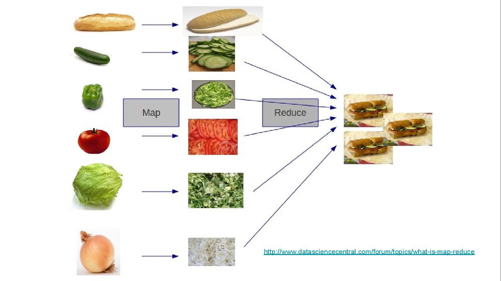

## map() reduce() filter() 区别

```js
// What you have
var officers = [
  { id: 20, name: 'Captain Piett' },
  { id: 24, name: 'General Veers' },
  { id: 56, name: 'Admiral Ozzel' },
  { id: 88, name: 'Commander Jerjerrod' }
];
// What you need
[20, 24, 56, 88]
```

如果使用forEach

```js
var officerId = [];
officers.forEach(function(officer){
    officerId.push(officer.id);
})

```
可以观察到这里需要建立一个空的数组
### map() 

```js
const officerId = officers.map(officer => officer.id);
```
那map()如何工作？他有两个参数，一个是回调，还有一个是可选的上下文，回调函数将会针对officers这个数组每个值运行，并且返回结果数组的每个值。


### reduce()
就像map()一样，reduce也会对数组每个元素进行回调，但是不同的是：这个回调函数中有一个accumulator（累加器）的结果，会从一个元素传递到另外一个

accumulator
累计器累计回调的返回值; 它是上一次调用回调时返回的累积值

currentValue
数组中正在处理的元素。

index 可选
数组中正在处理的当前元素的索引。 如果提供了initialValue，则起始索引号为0，否则从索引1起始。

array可选
调用reduce()的数组

initialValue可选
作为第一次调用 callback函数时的第一个参数的值。 如果没有提供初始值，则将使用数组中的第一个元素。 在没有初始值的空数组上调用 reduce 将报错。


回调函数第一次执行时，accumulator 和currentValue的取值有两种情况：如果调用reduce()时提供了initialValue，accumulator取值为initialValue，currentValue取数组中的第一个值；如果没有提供 initialValue，那么accumulator取数组中的第一个值，currentValue取数组中的第二个值。
```JS
var pilots = [
  {
    id: 10,
    name: "Poe Dameron",
    years: 14,
  },
  {
    id: 2,
    name: "Temmin 'Snap' Wexley",
    years: 30,
  },
  {
    id: 41,
    name: "Tallissan Lintra",
    years: 16,
  },
  {
    id: 99,
    name: "Ello Asty",
    years: 22,
  }
];
```
想要计算整个年限
```js
const totalYear = pilots.reduce(function(accumulator, pilot){
    return accumulator + pilot.years. //值为14+30+16+22 = 82
},0)
```

第二个参数是一个累加值的初始值, 注意这里设置的初始值为0.
对每个元组进行回调后，reduce会将累加器的值传递给下一个，最后返回最终的累加器的值。

想要得出，最有经验的pilot

```JS
const experiencedPilot = pilots.reduce(function(oldest,pilot){
    return oldest.years > pilot.years? oldest: pilot;
},{})
```

将oldest作为累加器，回调会将整个累加器与每个元素进行对比，如果对比的这pilot years > 前面那个，就把他赋值给当前的累加器。


## filter() 有一个数组，只需要返回其中的一些元素

```js
var pilots = [
  {
    id: 2,
    name: "Wedge Antilles",
    faction: "Rebels",
  },
  {
    id: 8,
    name: "Ciena Ree",
    faction: "Empire",
  },
  {
    id: 40,
    name: "Iden Versio",
    faction: "Empire",
  },
  {
    id: 66,
    name: "Thane Kyrell",
    faction: "Rebels",
  }
];
```
现在需要两组，一组的faction是empire，一组是rebels

```js
var empire = pilots.filter(pilot => pilot.faction === 'empire');
```

如果这个回调函数返回true,则当前元素会保存到这个empire数组中。


