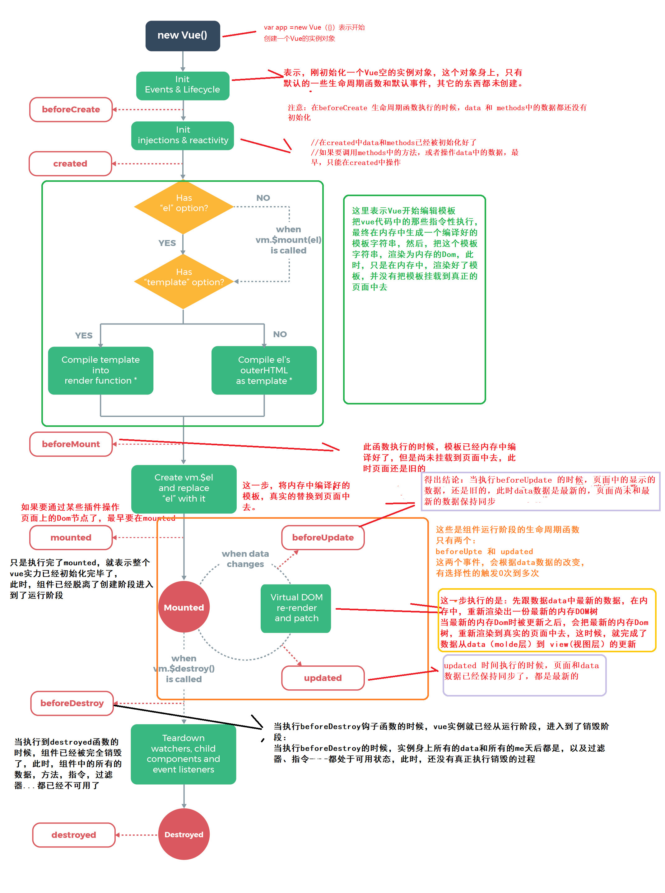

# Vue 笔记

## debug in chrome

1. 在root目录建立 'vue.config.js'文件

```js
module.exports = {
  configureWebpack: {
    devtool: 'source-map'
  }
};
```

2.点击debugger按钮，然后旁边有一个齿轮图标，点击 会出现lautch.json。要注意那个url和你的端口一样

```js
{
    "version": "0.2.0",
    "configurations": [
      {
        "type": "chrome",
        "request": "launch",
        "name": "vuejs: chrome",
        "url": "http://localhost:8080",
        "webRoot": "${workspaceFolder}/src",
        "breakOnLoad": true,
        "sourceMapPathOverrides": {
          "webpack:///./src/*": "${webRoot}/*",
          "webpack:///src/*": "${webRoot}/*"
        }
      }
    ]
  }
```

3.打上断点，npm run serve 然后点击debugger旁边的播放按钮

## Section 2

### {{}}

这个符号可以在里面放 data --> {{data}}

放 function --> {{function()}}

### v-bind

可以 set html value.

```html
<a v-bind:href="link">a link</a>


```

v-bind 可以替换成：

```html
<a :href="link">a link</a>
```

v-bind Style:

```html
<div
  class="demo"
  v-bind:style="{'border-color': boxASelected ? 'red' : '#ccc'}"
></div>
```

### v-html

这个 content should be interpreted to the html

```
<p v-html="rawHtml"></p>
```

### v-on

v-on:click= "" 检测 button 被点击

```html
<button v-on:click="add()">Add</button>
```

v-on:input = "" 监听 input 输入的内容,注意$event

```html
<input type="text", v-on:input="setName($event)"></input>
<p>{{name}}</p>
```

<!-- Js code -->

```javascript
methods:{
    setName(event){
        this.name = event.target.value;
    },
}
```

v-on:submit="" 写在表单里用来 sumbmit。

```html
<form v-on:submit.prevent="submitForm"></form>
```

```javascript
 methods:{
    submitForm(){
      //event.preventDefault();
      alert("Submitted");
    },
 }
```

### Modifier

点击鼠标右键出发事件

```html
<button v-on click.right=""></button>
```

使用 prevent 可以告诉 browser触发submit form事件，但是页面不要reload

```html
<form v-on:submit.prevent="submitForm"></form>
```

触发这个使用专门的 keyboard input. 使用 enter 建才可执行 keyboard method

```html
<input type="text" v-on:keyup.enter="keyBoard"></input>
```

可以将 v-on: 替换成@
Eg:

```html
<button @click.right=""></button>
```

### v-once

值始终只是初始值，不会改变

```
<p v-once>Starting counter: {{ counter }}</p>
```

### v-model

v-model 是 v-bind:value="" 和 v-on:input="" 缩写

```html
<input type="text" v-model="name" />
```

```javacript
data(){
  return{

  }
}
```

```html
<input type="text", v-on:input="setName($event)"></input>
```

### computed

这个 function 调用仅仅是依赖的响应式 只有当 property 变化时才会重新计算
这就意味着只要 message 还没有发生改变，多次访问 reversedMessage 计算属性会立即返回之前的计算结果，而不必再次执行函数。

computed VS methods
如果没有缓存，我们将不可避免的多次执行 A 的 getter！如果你不希望有缓存，请用方法来替代。

不加括号，因为这里面意义上不是 function。不要把所有的方法都写进 method 里，除非你的 value 是只要 page 变化了，他的 value 也要变化
为了提高性能

```javascript
<p>Your name: {{outPutFullName}}</p>

computed{
    outPutFullName(){
        ......
    }
}

```

### Watch

他会 excuted automatically by Vue 当这个 name property changes.

什么时候使用：当需要在数据变化时执行异步或开销较大的操作时，这个方式是最有用的。

name(value) watcher function 可以得到 last value

```javascript
watch{
    name(newValue,oldValue)
}
```

```javascript
const app = Vue.createApp({
  data() {
    return {
      name: "",
      fullName: "",
    };
  },
  watch: {
    name(value) {
      this.fullName = value + " " + "Xu";
    },
  },
});
```

## watch VS computed

Computed
Vue automatically evaluates its value every time one of its dependencies is changed. 注意是：dependency 改变

适合用在：need to calculate a value based on other properties

```javascript
computed: {
  total() {
    return this.price * this.quantity;
  }
}
```

Watch
A watcher is basically a function that Vue automatically executes when the watched property changes. 只能是单一的值

适合用在 HTTP calls, watch a data property until it reaches a specific value, and only then do something

上面的例子写下来就是这样的

```javascript
watch:{
  price(val){
    this.total = val * quantity
  }
  quantity(val){
    this.total = val * price
  }
}
```

1. HTTP calls

```javascript
export default {
  data() {
    return {
      actorId: null,
      movies: [],
    };
  },
  methods: {
    getMovies() {
      axios.get("movies/actor/${this.actorId}").then((resp) => {
        this.movies = resp.data;
      });
    },
  },
  watch: {
    actorId(val) {
      if (val) this.getMovies();
    },
  },
};
```

2.

```javascript
watch: {
  quantity(val) {
    if (val > this.stock) {
      this.error = true;
      this.errorMessage = `We only have ${this.stock} units`;
    }
  },
}
```

|                    Methods                    |                   Computed                    |                       Watch                        |
| :-------------------------------------------: | :-------------------------------------------: | :------------------------------------------------: |
|         Event binding & data Binding          |                 data binding                  |           Not used directly in template            |
| Data Binding: Methods 会被 excuted 每一次渲染 | computed property 会被执行当他的 value 改变了 | 允许你执行 code 当有些 data 改变了（Http request） |
|  使用：当你的事件和数据每时每刻都需要被执行   |     使用：当你的使用的数据依赖其他的数据      |           使用：当你的数据需要不断的变化           |

### Adding CSS style dynamic

```html
<div
  v-bind:class="boxASelected ? 'demo active' : 'demo'"
  v-on:click="boxSelected('A')"
></div>
```

```html
<div
  v-bind:class="{demo:true, active:boxASelected }"
  v-on:click="boxSelected('A')"
></div>
```

```html
<div
  class="demo"
  v-bind:class="{active:boxASelected }"
  v-on:click="boxSelected('A')"
></div>
```

```
 <div class="['demo',{active:boxBSelected}]"
 v-on:click="boxSelected('B')">
 </div>
```

### v-if v-else-if

v-if 里可以写判断语句，只要他的返回结果为 true 就可以

```html
<p v-if="goals.length === 0">No goals have be</p>

<ul v-else-if="goals.length > 0">
  <li>Goal</li>
</ul>
```

### v-show

```html
<p v-show="goals.length === 0">No goals have be</p>

<ul v-show="goals.length > 0">
  <li>Goal</li>
</ul>
```

v-if 与 v-show 区别
v-if 是 remove 或者是 add elements 去 DOM， 所以他会影响哪一个 element 是 DOM 的一部分

缺点：增加减少 element 会影响到 performance

..............................................

v-show 是 hide 或者 show items with css

缺点：他会有很多不被展示的 element
什么时候用？ -》 有一个 element 需要经常变化的，不然的话 就使用 v-if

### v-for

```html
<li v-for="goal in goals">Goal</li>
```

相当于 JS 的

```javascript
for(const goal for goals){

}
```

查看 array 里的 index

```html
<li v-for="(goal,index) in goals">{{goal}} - {{index}}</li>
```

输出 key:value

```
<ul>
    <li v-for="(value,key) in {name:'Max', age:18}">{{key}}: {{value}}</li>
</ul>
```

v-for 常见 bug

```html
<ul v-else-if="goals.length > 0">
  <li v-for="(goal,index) in goals">
    {{goal}} - {{index}}

    <button v-on:click="removeGoal(index)">remove</button>

    <input type="" />
  </li>
</ul>
```

当你删除一个 goal[0]时，仅仅是将 goal[1] move to goal[0].但是此时的 goal[0]的 input 仍然是原来 goal[0]的 input。
所以会出现，当删了第零个元素的时候，input 仍然是第零个 input 里的

解决方案：
增加一个 key attribute，这个 attribute 仅仅是 VUE 可以 detected 不是 HTML attribute

```
<li v-for="(goal,index) in goals" v-on:key = "goal">
```

### Proxy

先看一个案例

```javascript
let data = "hello";
let longData = data + "world";
console.log(longData);
data = "hello!!!!";
console.log(longData);
```

输出结果

```
helloworld
helloworld
```

可见，当这个 data 改变时，这个 longdata 不会随之改变。所以这时需要使用 proxy

#### Proxy 使用

```javascript
const data = {
  message: "Hello",
};

const handle = {
  set(target, property, value) {
    console.log(target);
    console.log(property);
    console.log(value);
  },
};

const proxy = new Proxy(data, handle);
proxy.message = "hello world";
```

输出结果：

```
{message: "Hello"}message: "Hello"[[Prototype]]: Object
message
hello world
```

在看这个案例：

这个就实现了，当 message 改变，通过使用 proxy，long message 也会改变,这样就可以建立一个 reactive system

```javascript
const data = {
  message: "Hello",
  longMessage: "",
};

const handle = {
  set(target, property, value) {
    if (property === "message") {
      target.longMessage = value + " longMessage";
    }
    target.message = value;
  },
};

const proxy = new Proxy(data, handle);
proxy.message = "hello world";
console.log(proxy.longMessage);
```

输出结果

```
hello world longMessage
```

vue 的工作原理同这个一样，追踪 data property，当有一个 property 改变了，他也会更新你 app 里那个 data

### var let const 区别

#### 1. scope

let const 是 block scope
var 是 function scope

```javascript
if (true) {
  var varVariable = "This is true";
}
console.log(varVariable);

if (true) {
  let letVariable = "This is true";
}
console.log(letVariable);

if (true) {
  const constVariable = "This is true";
}
console.log(constVariable);
```

输出结果

```
This is true
ERROR!
ERROR!
```

#### 2. Redeclare

Var 可以重新申明
let const 不可以

```javascript
var varVariable = "This is true";
var varVariable = "This is false";
console.log(varVariable);

let letVariable = "This is true";
let letVariable = "This is false";
console.log(letVariable);

const constVariable = "This is true";
const constVariable = "This is false";
console.log(constVariable);
```

输出结果

```
This is false

ERROR!

ERROR!

```

#### 3. 创建一个新的 variable 在使用之后

var 允许创建一个 variable 在使用之后，仍然允许我们去运行，然后认为那个 variable 是存在的
let const 不可以

```javascript
console.log(varVariable);
var varVariable = true;

console.log(letVariable);
let letVariable = true;

console.log(constVariable);
const constVariable = true;
```

输出结果

```
undefined

Uncaught ReferenceError: Cannot access 'letVariable' before initialization

Uncaught ReferenceError: Cannot access 'constVariable' before initialization
```

### declare and update

const 不能够被更新也不能被重新申明，但是 let 和 var 可以

```javascript
let letVariable = 2;
const constVariable = 2;

letVariable = 3;
constVariable = 3;
```

输出结果

```
Uncaught TypeError: Assignment to constant variable.
```

const 不允许改变的 actual value 或者重新定义他，但是改变他的属性是可以的

```javascript
const constVariable = { name: "Amy" };
constVariable.name = "Evonne";
console.log(constVariable.name);
```

输出结果

```
Evonne
```

## variable shadowing

什么是 variable shadowing？
variable shadowing 发生在当一个 inner scope 的 variable 和 outer scope 的 的 variable 名字一样。这个的 variable 就会 scope 重叠

variable scoping rules：
inner scope 可以 access outer scope 的 variable。

```javascript
let number = 10;

function displayDouble() {
  //a new variable is defined with the same name as variable on line 1 - outer scope
  let number = 3;

  number *= 2;
  console.log(number); //=> 6
}

displayDouble();
console.log(number); //=> 10
```

这个例子中在 outer scope 和 inner scope 都有一个名字叫 number 的变量。
产生的结果是：outer scope 定义的变量会被 inner scope 隐藏。

1. 他会防止 inner scope 的变量 access outer scope 的变量
2. 他会防止 inner scope 去改变和重新定义 outer scope 的变量

所以这个例子中：

1. 在 inner scope 我们不能够访问到外部名字叫 number 的变量
2. number 在 inner scope 里的不能修改 outer scope 的 number 变量

## This keywords

#### （作为函数调用 -> 指向全局对象，严格模式 undefined）默认绑定

```javascript
function girl(){
    console.log(this); => window
}
girl();
```

#### 调用对象方法 -> 指向这个方法的对象）隐式绑定

```javascript
var girl = {
    name:'amy',
    age:28
    detail: function(){
        console.log(this.name); -> amy
        console.log(this.age); -> 28
    }
}
girl.detail(); //这个方法是在girl里面的，所以this发生了隐式绑定，所以指向girl.
```

#### 特殊调用 -> 指向参数成员 硬绑定####

```javascript
var girlName = {
    name:'amy',
    sayName:function(){
        console.log(this.name);
    }
}
var girl1 {
            name : 'Sally'
          }
var girl2 {
            name : 'Jennie'
          }
girlName.sayName.call(girl1); -> sally
girlName.sayName.call(girl2); -> Jennie

```

#### 构造函数绑定 (new)-> 指向这个函数

```javascript
function lover(name){
    this.name = name;
    this.sayName = function(){
        console.log(this.name); -》 amy
    }
}
var amy = new lover('amy');
amy.sayName();
```

#### Arrow function -》指向的是父级对象

```javascript
let fn = {
  name: "Sally",
  init: () => {
    console.log(this.name); //=> undified
  },
};
fn.init();
```

如果是 function，就会产生隐式绑定

```javascript
let fn = {
  name: "Sally",
  init: function () {
    console.log(this.name); //=> Sally
  },
};
fn.init();
```

---

## Refs

```javascript
<input type = "text" @input = "saveInput"></input>
<button> @click="setText">Set Text</button>
<p>{{ message }}</p>

data() {
    return {
      currentUserInput: '',
      message: 'Vue is great!',
    };
  },
methods:{
    saveInput(){
        this.currentUserInput = event.target.value;
    }
    setInput(){
        this.message = this.currentUserInput
    }
}
```

```javascript
<input type = "text" ref = "userText"></input>
methods:{
    saveInput(){
        this.currentUserInput = event.target.value;
    }
    setInput(){
        this.message = this.$refs.userText.value; //使用了REF变量去get值
    }
}
```

### How Vue update DOM

什么是 DOM？
DOM（document object model）,DOM 将文档解析为一个节点和对象组成的结构集合。

浏览器渲染中，浏览器解析 HTML 标签,构建 DOM 树 🌲


---

当在 input 里面输入变量点击旁边的 button 键，可以发现在 chrome develop tool 中的 message 会发生变化，

```html
<p>{{message}}</p>
```

#### vue 通过一个叫做 虚拟 DOM 实现了 这一点

VUE 怎么 update 这个 DOM？
| Vue instance                                   | Browser DOM                                                                                                                                                                                                                                                                                                           |
| ---------------------------------------------- | --------------------------------------------------------------------------------------------------------------------------------------------------------------------------------------------------------------------------------------------------------------------------------------------------------------------- |
| 保存 data,computed,methods,properties          | Vue instruction 会被 VUE 移除，当 DOM 渲染的时候。 比如我们写的那些动态部分，占位符等会被移除。 <br> 🌰 例子：我们在我们的 chrome develop tool 中的 html 中看不到{{}}这样的括号，也看不到@click = “setText”只能看到的是一个普通的 p 或者 button） <br>vue 在这里做的就是当要渲染时，他会将 template 转变为 actual HTML |
| data computed peoperties 会改变因为 user input | 这些改变是应该被影响的，但是 vue 不会每次重新渲染那整个 page                                                                                                                                                                                                                                                          |

VUE 是怎么做到仅仅渲染那个改变的部分呢？

1. Vue detect change,创建了一个 new virtual DOM （也不是创建一整个虚拟的 DOM，他会有很多的优化方法）
2. 比较这个 new vitual DOM 和 old vitual DOM,去 detect 他们的不同，然后去更新那个不同的部分在 real DOM 中

---

## Vue instance lifecycle

生命周期函数：在某个时刻会自动执行的函数

#### createAPP({...})

⬇️

#### beforeCreate(): Vue 实例（data methods）创建之前

⬇️

#### created() : Vue 实例创建完毕

> 现在 VUE 知道了 data peoperty 和一些基本的 app configuration，
> VUE 编辑模版，将动态占位符,插值替换为具体的值,然后将这个模版渲染为内存中的 DOM

⬇️

#### beforeMount(): 模版渲染到页面之前

> 将内存中的模版替换到浏览器页面中去
> ⬇️

#### mounted(): 可以在浏览器看到了

---

### Data Change

⬇️

#### beforeUpdate():界面上的数据还未更新，但是数据已经更新了

⬇️

> 1.  Vue detect change,创建了一个 new virtual DOM （也不是创建一整个虚拟的 DOM，他会有很多的优化方法）
> 2.  比较这个 new vitual DOM 和 old vitual DOM,去 detect 他们的不同，然后去更新那个不同的部分在 real DOM 中

#### updated():界面上的数据更新

---

### Instance unmounted

#### beforeUnmount():在卸载组件实例之前调用。在这个阶段，实例仍然是完全正常的。

#### Unmounted():组件实例的所有指令都被解除绑定



## Mutiple App VS Multiple Components

### Multiple App

independent parts of HTML pages

Vue apps are independent from each other - they can't really communicate with each other.

### Multiple Components

DO offer certain communication mechanisms that allow you to exchange data between them

### Vue CLi

1. vue create (app name)
2. ? Please pick a preset:
   Manually select features

? Check the features needed for your project: Choose Vue version, Babel, Linter

? Choose a version of Vue.js that you want to start the project with 3.x

? Pick a linter / formatter config: Basic

? Pick additional lint features: Lint on save

? Where do you prefer placing config for Babel, ESLint, etc.? In dedicated config files

? Save this as a preset for future projects? No

? Pick the package manager to use when installing dependencies: NPM

3. cd (app address)
4. npm run serve

当下载一个新的 project 里面没有 node-module 时

1. terminal - new terminal
2. npm install
3. npm run serve

---

## Component Communication(parent => child)

Default export this App.vue file:

Main.JS File

```Javascript
default import: import App from './App.vue'
createApp(App).mount('#app')
```

App.Vue File

```Javascript
export default{
    data(){

    }
}
```

---

## 建立 components，data 可以从 parent 传输到 child(props)

1. 建立 components folder under src
2. ### 建立 components 文件 FriendContact 文件

   ```Javascript
   <template>
   //写你想写的模版
   <h2>{{firstName}}<h2>
   <h2>{{lastName}}<h2>
    <h2>{{age}}<h2>
   </template>

   <script>
   export defualt{ //这是该组件的配置对象，每个组件相当于一个小型VUE，它采用相同的配置对象
       props:{
        firstName:{
            type: String,
            required: true
        },
        lastName: String,
        age: String,

    },//这个就跟data()一样
       data(){
           ...
       }
   }
   </script>
   ```

   3. ### App.vue 文件中

   ```Javascript
    <template>
    <friendContact
        v-for = "friend in friends"
        :key = friend.id
        :first-name = friend.firstName
        :last-name = friend.lastName
        :age = friend.age>//注意这里需要dash，因为这个写的是HTML里的元素
    </friendContact>
    //调用friendContact模版，并且传递数据
    </template>

    <script>
    export default{
        data(){
            friends[
            {
                id: "Evonne",
                firstName: "Evonne",
                lastName: "Xu",
                age:28

            },
            {
                id: "Sally",
                firstName: "Sally",
                lastName: "Xu",
                age:28
            },
            ]
        },
        methods:{
            ...
        }

    }
     </script>

     <style></style>
   ```

   4. main.js 文件中

   ```Javascript
   //先import所有要用的页面
   import{createApp} from 'vue';
   import App from './App.vue';
   import FriendContact from './components/FriendContact.vue';

   const app = createApp(App); //把APP放进去，创建一个app object
   app.component('friend-contact',FriendContact);//在这个组件参数传递进去
   app.mount('#app');
   ```

   ⚠️ 注意‼️： 当数据通过 props 传输到 components 后，components 不能对 data 进行改变！

---

### 想要改变从 APP.vue 传递到组件的 data

--- 简单的方法：

components File:

1. 添加那个 data 到 组件的 props 中
2. 写 componentsData = this.data -> 写这个到 data(){}

components file

```javascript
props:['name','age','isFavorite'],
data(){
    return{
        friendIsfavorite = this.isFavorite
        //可以赋值，然后使用它
    }
}

```

## 复杂的方法 ⬇️（让 parent 知道要改变 data，parent data change in itself，然后再将改变的 data 返还回来）

## 发射自定义事件（child => parent communication）

1. Child File(FriendContact)-> emit event

```javascript
toggleFavoite(){
    this.$emit('toggle-favorite',this.id); // call inside vue components 使用emit,（起一个事件名字,data）data是作为一个参数当被emit一个event
}
```

```javascript
export default{
  emits:['toggle-favorite'];
}
```

2.Parent file(App.vue) -> listen event

```
<friendContact
<!-- bind this 与 js code, 当事件发生时，这个应该被执行 -->

@toggle-favorite  = "toggleFavoriteStatus"

></friendContact>
```

```javascript
methods:{
    toggleFavoriteStatus(friendId){
        const identifiedFriend = this.friends.find(friend => friend.id === friendId) // friends array where the friend.id property holds same value as the friendId argument
        identifiedFriend.favorite = !identifiedFriend.favorite
    }
}
```

## 验证 Event

```javascript
emits:{
    'toggle-favorite':function(id){
        if(id){
            return true;
        }else{
        console.warn('Id is missing');
          return false;}
    }
}
```

## adding more communication

delete Contact

```javascript
 deleteFriend(id){
        this.friends = this.friends.filter(friend => friend.id !== id);
        // filter methods: 当里面是true就保存他，如果是false就删除。 如果ID相同，就返回false
    }

```

## Provide + inject =》只要当有 long communication 时在用

当有 components 嵌套时：层级如下 ⬇️
knowledge-base： 不需要 topics data
knowledge-grid：需要 topics data
knowledge-element:需要 topics data

不想通过 APP.vue 传给 knowledge-base 然后再传给
knowledge-grid，这时需要 provide 和 inject

APP.vue 文件：

```
<template>
  <div>
    <knowledge-base @select-topic="activateTopic"></knowledge-base>
  </div>
</template>

<script>
export default {
  data() {
    return {
      topics:[
        {
          id: 'basics',
          title: 'The Basics',
          description: 'Core Vue basics you have to know',
          fullText:
            'Vue is a great framework and it has a couple of key cg!',
        },
        {
          id: 'components',
          title: 'Components',
          description:
            'Components are a core concept for building Vue UIs and apps',
          fullText:
            'With components, you can split logic (and markup) into separate',
        },
      ],
      activeTopic: null,
    };
  },
  provide(){
    return{
      topics:this.topics
    }
  },
}
```

knowledge-grid 文件中：写上注入 data

```
<script>
export default {
  inject:['topics'],
};
</script>
```

## Provide + Inject for function

App.vue 文件

```javascript
<script>
export default {
  provide(){
    return{
      topics:this.topics,//data
      selectTopic:this.activeTopic //function
    }，
    methods:{
      activeTopic(topicId){
        this.activeTopic = topics.find((topic) => topic.id = topicId )
      }
    }

  }
}
</script>
```

components 文件

```javascript
<script>
export default {
  inject:['selectTopic'],
</script>
```

---

## Slot

允许接受 html content from outside component

BaseCard html

```html
<template>
  <div>
    <!-- 相当于可以将user info里的html放到这里来 -->
    <slot></slot>
  </div>
</template>
```

Userinfo html

```html
<template>
  <base-card>
    <header>
      <h3>{{fullName}}</h3>
      <p>{{innerText}}</p>
    </header>
  </base-card>
</template>
```

## Named Slots

一个 slots 是给 header，一个是 default slots

BaseCard html（使用 slot）

```html
<template>
  <div>
    <!-- 使用name slot -->
    <!-- 如果components中有一个使用v-slot：header，就会执行这个header代码 -->
    <!-- 这个v-if就是当调用他的那个组件里面使用了header这个slots才会render 这样可以提高性能，要不然如果只写下面的name他每次都会render，尽管是undefined-->
    <header v-if="$slots.header">
      <slot name="header">
        <h2>The default header</h2>
      </slot>
    </header>

    <!-- 这个是default slot -->
    <slot></slot>
  </div>
</template>
```

Userinfo html

```html
<template>
  <section>
    <base-card>
      <!-- 这个template里面的content将会进入一个名叫'header'的 slots -->
      <!-- 也可以写成 <template #header>  -->
      <template v-slot:header>
        <h3>{{ fullName }}</h3>
      </template>

      <template v-slot:default>
        <p>{{ infoText }}</p>
      </template>
    </base-card>
  </section>
</template>
```

## scoped slot

可以让你传输 data 从你的 components 内部去你的 components 标记那里的 slot

内部 component(courseGoals.vue)

```html
<template>
  <ul>
    <li v-for="goal in goals" :key="goal">
      <!-- pass goal for every iteration in item -->
      <slot :item="goal" another-prop="..."></slot>
    </li>
  </ul>
</template>

<script>
  export default {
    data() {
      return {
        goals: ["Finish the course", "Learn Vue"],
      };
    },
  };
</script>
```

你想传递 data 的 components(app.vue)

```html
<template>
  <course-goals>
    <!-- 这个slot- props是一个对象 是前面定义的item的集合 -->
    <template #default="slotProps">
      <h2>{{slotProps.item}}</h2>
      <h2>{{slotProps.anotherProp}}</h2>
    </template>
  </course-goals>
</template>
```

## Dynamic components

使用
`<components> </components>`哪一个 components 应该展示

点击一个按钮显示该 components 的内容，当点击另外一个时候，重置 property 内容，将组建的名字放入`<components :is = "组件名"> </components>`

```html
<template>
  <div>
    <the-header></the-header>
    <button @click="SetSelectedComponents('active-goals')">Active Goals</button>
    <button @click="SetSelectedComponents('manage-goals')">Manage Goals</button>
    <!-- components不会被销毁，他们的state会被保存 -->
    <keep-alive>
      <component :is="selectedComponent"></component>
    </keep-alive>
  </div>
</template>
```

```javascript
<script>
import TheHeader from './components/TheHeader.vue';
import ActiveGoals from './components/ActiveGoals.vue';
import ManageGoals from './components/ManageGoals.vue';
export default {
  components:{
    TheHeader,
    ActiveGoals,
    ManageGoals
  },
  data() {
    return {
      selectedComponent:'active-goals',
    };
  },
  methods:{
    SetSelectedComponents(cmp){
      this.selectedComponent = cmp
    }
  }
};
</script>
```

## Teleport

```html
<template>
  <!-- to里面写css selector  -->
  <teleport to="body">
    <error-alert v-if="inputIsInvalid">
      <h2>Input is invalid</h2>
      <p>Please enter at least characters</p>
      <button @click="confirmError">OKay</button>
    </error-alert>
  </teleport>
</template>
```

这样这个 dialog 就会在 body section 的最下面，而不是 nested 别 element 旁边。可以让你的 HTML structure 正确

## v-model && refs

```html
<form @submit.prevent = "submitForm">
    <div class="form-control">
      <label for="age">Your Age (Years)</label>
      <input id="age" name="age" type="number" v-model = "userAge"  ref = "ageInput/>
    </div>
</form>
```

```javascript
<script>

export default ({
  data(){
    return{
      userAge:null,
    }
  },

 methods:{
   submitForm(){
      console.log(this.userAge); //这个出来的data type: number
      console.log(this.$refs.ageInput.value);
      //这个出来的data type: string
   }
 }
})
</script>
```

v-model 如果你在 input 上面写的 type 是 number, v-model 会 automatically fetch user input,然后将 string data type 转化为 number data type。

v-model.lazy 就是只有你取消了 input 才回更新
link: https://codepen.io/itrong/pen/EvqBrW

v-model.trim 将会 remove 空格在之前或者之后的 text 里

v-model.number 将值转化为 number

如果使用 ref,他保存的 value 只是 string

## forms

输入值：

label -> FOR ATTRIBUTE:指定标签绑定到哪个表单元素
例子：下方的for="fName"和input 的 id = "fName"的值一样， 这就属于绑定起来了

input -> TYPE ATTRIBUTE: 定义input的类型，
        NAME ATTRIBUTE： 提交到服务器后的表单数据进行标识

```HTML
<form>
    <div class="form-control">
      <label for="fName">First Name</label>
      <input type="text" id="fName" name="fName" />
    </div>
</form>
```

下拉框：

```html
<div class="form-control">
  <label for="referrer"> Hear about us? </label>
  <select id="referrer" name="referrer" v-model="referrer">
    <option value="Google">Google</option>
    <option value="wom">Word of mouth</option>
    <option value="newspaper">Newspaper</option>
  </select>
</div>
```

checkbox 加入 value 属性，不然 vue 不知道应该加哪个进入 array

```html
<div class="form-control">
  <label for="interest"> What are you interested in? </label>
  <div>
    <input
      id="interest-news"
      type="checkbox"
      name="interest-news"
      value="interest-news"
      v-model="interest"
    />
    <label for="interest-news">News</label>
  </div>
  <div>
    <input
      id="interest-tutorials"
      type="checkbox"
      name="interest-tutorials"
      value="tutorials"
      v-model="interest"
    />
    <label for="interest-news">Tutorials</label>
  </div>
</div>
```

radio 同样 他也需要加上 value attribute

```html
 <div class="form-control">
      <h2>How do you learn?</h2>
      <div>
        <input id="how-video" name="how" type="radio" value = "video" v-model = "how"/>
        <label for="how-video">Video Courses</label>
      </div>
      <div>
        <input id="how-blogs" name="how" type="radio" value = "blogs" v-model = "how"/>
        <label for="how-blogs">Blogs</label>
      </div>
  </div>
```

```javascript
<script>

export default ({
  data(){
    return{
      referrer:'wom',
      interest:[],
      how:null,
      confirm: false
    }
  },

 methods:{
   submitForm(){
     console.log(this.referrer);
     console.log(this.interest);
     console.log(this.how);
     console.log(this.confirm);
     this.referrer = 'wom';
     this.interest = [];
     this.how = null;
     this.confirm = false

   }
 }
})
</script>
```

## form validation

加入@blur，当 input invalid 的时候触发

设置 class,当 class 为 valid 时，css 变化

加入 p,设置 if 判断

```html
<form @submit.prevent="submitForm">
  <div class="form-control" :class="{ invalid: userNameValidty === 'invalid' }">
    <label for="user-name">Your Name</label>
    <input
      id="user-name"
      name="user-name"
      type="text"
      v-model.trim="userName"
      @blur="validateInput"
    />
    <p v-if="userNameValidty === 'invalid'">Please enter a valid name</p>
  </div>
</form>

```
```js
validateInput() {
      if (this.userName === '') {
        this.userNameValidty = 'invalid';
      } else {
        this.userNameValidty = 'valid';
      }
    },
```

## v-model on components

v-model 是 监听 @input = "" 和 绑定 value = “”
如果你在 components 使用 v-model，vue 会 set 一个 special prop，同时也会监听一个 special event

form html

```html
<div class="form-control">
  <rating-control v-model="rating"></rating-control>
</div>
```

v-model 使用 modelvalue 作为 prop，update:modelValue 作为 event

ratingControl (components Html)

```html
<template>
  <ul>
    <li :class="{ active: activeOption === 'Poor' }">
      <button type="button" @click="active('Poor')">Poor</button>
    </li>
    <li :class="{ active: activeOption === 'Average' }">
      <button type="button" @click="active('Average')">Average</button>
    </li>
  </ul>
</template>
```

不要使用 data，应该使用 compute，这样当我们的 model value 改变时候，相应的 active Option 也会改变

为什么 computed 里面要那么写？

因为当我们选择一个新的选择后，就会 emit 一个新的事件，然后储存到 form html 里的 rating 这个 data 里。
现在 v-model 是被用来反馈给这个组件，更新 prop 的值。
所以我们在组件里 需要写 computed 一旦 model Value 更新了，也需要更新 activeOption 的值

简单的办法：舍去 computed，将 activeOption 用 modelValue 替代

```javascript
<script>
export default {
  props:['modelValue'],//data
  emits:['update:modelValue'],//event

  // data() {
  //   return {
  //     activeOption: this.modelValue,//我们get到的value from prop
  //   };
  // },
  computed:{
    activeOption(){
      return this.modelValue;
    }
  }

  methods: {
    active(option) {
      this.activeOption = option;
      this.$emit('update:modelValue',option);
    }
  }
}
</script>
```

## Sending Http request

fetch post

```javascript
fetch("https://vue-http-demo-34993-default-rtdb.firebaseio.com/surveys.json", {
  method: "POST",
  headers: {
    "Content-Type": "appilcation/json",
  },
  body: JSON.stringify({ name: this.enteredName, rating: this.chosenRating }),
});
```

axios

```javascript
import axios from 'axios'

axios.post('https://vue-http-demo-34993-default-rtdb.firebaseio.com/surveys.json'{
  name:this.enteredName,
  rating: this.chosenRating
})
```

fetch get

fetch 会返还一个叫 promise 的

如果你 send http request 会花费一些时间，JavaScript 不会停止并且等待别的 code 运行结果，这样的好处就是这个 app 不会因为等待结果而 freeze，这就是 promise 背后的思想。
Fetch 会返还一个对象，一旦这个结果出来了，我们可以建立一个 then()去监听结果

```javascript
fetch("https://vue-http-demo-34993-default-rtdb.firebaseio.com/surveys.json")
  .then(function (response) {
    if (response.ok) {
      return response.json();
    }
  })
  .then(function (data) {
    console.log(data);
  });
// 第二个then method会执行当第一个then已经完成了
```

## Handle error message

fetch

```javascript
fetch("https://vue-http-demo-34993-default-rtdb.firebaseio.com/surveys.json", {
  method: "POST",
  headers: {
    "Content-Type": "appilcation/json",
  },
  body: JSON.stringify({ name: this.enteredName, rating: this.chosenRating }),
})
  .then((response) => {
    if (response.ok) {
    } else {
      throw new Error("Could not save data");
    }
  })
  .catch((error) => {
    this.error = error.message;
  });
```
如果fetch 需要get某个ID，然后将数据存进去
```js
//使用async
async registerCoach(context,data){
   const userId = context.rootGetters.userId;
   const newCoach = {
      firstName: data.fName,
      lastName: data.lName,
   };
  const response = await fetch(`https://......./coaches/${userId}.json`,{
    methods:'POST',
    body:JSON.stringify(newCoach)
  });//使用``而不是,可'',可以将js的{}写进去
  context.commit('registerCoach', {id:userId, ...newCoach});//当前面的fetch中有userID 时候，server就会建立一个userId的表，不需要在newCoach这个数据中加入id这个属性。但是后面的文件还需要使用id，所以使用{}的意思就是把里面的东西存成一个object，...意思就是将newcoach拆开

}

```

## Post 和 Put区别：
1.使用PUT需要明确操作对象
```
PUT/cutomer/doc/1
{
  "name:":"John"
}
```
PUT就是明确需要操作的对象是doc/1,如果该文档存在就直接替换整个文档的内容，如不存在就创建一个

2.使用POST创建对象
```
POST/customer/doc/1
{
  "name:":"John"
}
```
这里的不同是POST请求不知道要操作的对象，他只是像HTTP提交一篇文档，由HTTP产生新的编号

2. POST修改对象
```
POST /customer/doc/1
{
"description": "I am a student"
}
```
这里的含义是给编号为1的文档增加属性‘description’

(1)这个编号1必须是存在的文档,否则必须使用PUT
(2)对象部分内容修改

---


## Promise && async await

```js
const promise1 = new Promise((resolve,reject) => {
  if(true){
      resolve('video1 record');
  }
  reject('Failed to record');
});
const promise2 = new Promise((resolve,reject)=>{
  resolve('video 2 record');
});
const promise3 = new Promise((resolve,reject)=>{
  resolve('video 3 record');
});

//一般情况会使用一个promise然后再让他做些事情
promise1.then((message)=>{
  console.log('This is a message' + message); 
  }).catch((message) => {
    console.log('This is in catch' + message);
  })

//如果想让promise 1 2 3同时进行，可以使用 promise.all

Promise.all([promise1,promise2,promise3]).then((message) => {

  console.log(message);//[ 'video1 record', 'video 2 record', 'video 3 record' ]

})

```
## aync await

```js
function makeRequest(location){
  return new Promise ((resolve,reject) => {
    if(location === 'Google'){
      resolve('Google say hi');
    }else{
      reject('only talk to Google');
    }
  });
}

function processRequest(response){
  return new Promise((resolve,reject) => {
    resolve(`This is process Request + ${response}`);
  })
}

//promise,then
makeRequest('Google').then((response) => {
  return processRequest(response)
}).then((processResponse) => {
  console.log(processResponse) //This is process Request + Google say hi
}).catch((err) => {
  console.log(err); 
})

//await async

async function doWork(){
  const response = await makeRequest('Google');
  const processResponse = await processRequest(response);
  console.log(processResponse);

}
doWork();

```


## Routing SetUp

```
npm install vue-router@next --save
```

main.js

第一步：创建 router，让 vue 知道这些 routes，并且当它们 visit path 时候，知道应该加载哪个 components

```javascript
import { createRouter, createWebHistory } from "vue-router";
import TeamsList from "./components/teams/TeamsList.vue";

import UsersList from "./components/users/UsersList.vue";

const router = createRouter({
  //让用户知道last page是什么
  history: createWebHistory(),
  //diffrent URL 你需要使用的，使用array是不可能只使用一个router
  routes: [
    { path: "/teams", component: TeamList },
    { path: "/users", component: UsersList },
  ],
  //overwirte 别的css class name,而不是使用默认的router-link-active
  linkActiveClass: "active",
});

export default router; //将router的内容写到，router.js,这行代码的作用是这样就可以import 这个去 another file

app.use(router); //make our vue app aware of this router
```

2.vue 不知道从哪里加载这个 components.由于我们写了 app.use(router),可以使用内置组件

app.vue.js

```html
<template>
  <the-navigation @set-page="setActivePage"></the-navigation>
  <main>
    <!-- <component :is="activePage"></component> -->
    <router-view></router-view>
  </main>
</template>
```

navigation.js

```html
<template>
  <header>
    <nav>
      <router-link to="/teams">Teams</router-link>
      <!-- 这个和<a href:>很像，但是不同的是，这个<router-link>是一个special anchor tag，这个不会load different page或者load整个app从而失去当前的状态。
      router进行接管，并且make sure browser default prevented, browser不会加载different page。 分析用户点击的链接，然后加载组件，更新URL -->
      <!-- to attribute就是hold这个你想去的path， -->
    </nav>
  </header>
</template>

<style scoped>
  /* router-link-active是默认的class，当你点击link时候，他就会出现一个这个class，你可以根据这个设置相应的css */
  a.router-link-active {
    color: #f1a80a;
    border-color: #f1a80a;
    background-color: #1a037e;
  }
</style>
```

## Router promatically navigation

使用 this.$router.push('/teams')，可以点击某个 button，然后将你导航到你想去的 path

```html
<template>
  <button @click="linkToTeamPage">link to team page</button>
</template>
```

```javascript
 methods:{
    linkToTeamPage(){
      this.$router.push('/teams');
    }
  }
```

## pasing data with route params

1.定义好 dynamic router

main.js

```javascript
import TeamsList from './components/teams/TeamsList.vue'

import TeamMembers from './components/teams/TeamMembers.vue'

const router = createRouter({
  history:createWebHistory();
  router:[
    {path:'./teams',component:TeamsList},
    {path:'./teams/:teamId',component:TeamMember}
    //:teamId dynamic router
  ]
});
app.use(router);
```

2.在 created lifecyle hook 这个阶段所有的 data 都已经 available 了，我们可以 get 到$route.params,知道这个 router 的信息。然后可以根据信息展示出来

TeamMembers.js

```html
<template>
  <section>
    <h2>{{ teamName }}</h2>
    <ul>
      <user-item
        v-for="member in members"
        :key="member.id"
        :name="member.fullName"
        :role="member.role"
      ></user-item>
    </ul>
  </section>
</template>

<script>
  export default {
  inject:['teams','users'],
  components: {
    UserItem
  },
  data() {
    return {
        teamName:'',
        members:[]
    };
  },
  created(){
    const teamId = this.$route.params.teamId;
    const selectedTeam = this.teams.find(team => teamId === team.id);
    const selectedMember = selectedTeam.member;
    const teamMembers = [];
    for(const member of selectedMember){
      const selectedUser = this.users.find(user => user.id === member);
      teamMembers.push(selectedUser);
    }
    this.teamName = selectedTeam.name;
    this.members = teamMembers;
  }
</script>
```

## Routing passing params using props

vue router 不会 destroy 和 recreate 一个新的 component，仅仅因为 URL 变化。
所以当你在这个页面上了，你想再次载入，根据不同的数据，默认情况下，vue router 不会工作。所以这个 created 不会再次 run Again
URL change -> $route.params 改变

main.js

```javascript
import TeamMembers from "./components/teams/TeamMembers.vue";

const router = createRouter({
  history: createWebHistory(),
  routes: [
    { path: "/teams/:teamId", component: TeamMembers, props: true },
    //在path中加入,props:true, 可以让router知道pass这个teamId作为props
  ],
});
```

TeamMember.js

```html
<template>
  <section>
    <h2>{{ teamName }}</h2>
    <ul>
      <user-item
        v-for="member in members"
        :key="member.id"
        :id="member.id"
        :name="member.fullName"
        :role="member.role"
      ></user-item>
      <router-link to="/teams/t2">router Link</router-link>
    </ul>
  </section>
</template>
```

```javascript
import UserItem from "../users/UserItem.vue";

export default {
  props: ["teamId"], //使用props用来接受URL的teamId
  methods: {
    loadTeamMembers(teamId) {
      const selectedTeam = this.teams.find((team) => teamId === team.id);
      const teamMembers = selectedTeam.members;
      const selectedMembers = [];
      for (const member of teamMembers) {
        const selectedUser = this.users.find((user) => user.id === member);
        selectedMembers.push(selectedUser);
      }
      this.members = selectedMembers;
      this.teamName = selectedTeam.name;
    },
  },
  created() {
    this.loadTeamMembers(this.teamId); //在page还未render的时候，拿到了prop的URL，执行上面的methods
  },
  watch: {
    teamId(newId) {
      this.loadTeamMembers(newId); //监视当teamId发生变化了，将Id传入进去，执行method方法
    },
  },
};
```

## route redirect && ‘Catch ALL’

这样就可以当你进入一个网址：http://localhost:8082/ 的时候，这个会自动切换到 http://localhost:8082/teams

```html
{path: '/', redirect: '/teams'}
```

加载相同的组件，使用不同的 route 名字 alias 相当于别名，

```html
{path:'/teams', component:TeamList, alias:'/'}
```

如果用户输入了不同的 URL,想要出现 404 页面

```
{path:'/:notFound(.*)',component:NotFound}
```

.\* 意思是 any character combination，需要执行这条语句

## Nested Routes

适用于复杂的项目，比如你想加载 different part nested in different components,然后有不同的 URL

main.js

```javascript
const router = createRouter({
  history: createWebHistory(),
  routes: [
    {
      path: '/teams',
      component: TeamsList,
      children: [
        { path: '/teams/:teamId', component: TeamMembers, props: true },
         { path: 'contact', component: TeamMembers, props: true },
        //将children routes写进去,注意前面没有'/'
      ],
    },
});
```

TeamList.js

```html
<template>
  这个可以让vue知道在这里调用nested route
  <router-view> </router-view>
</template>
```

## Named Routes

main.js

```javascript
const router = createRouter({
  history: createWebHistory(),
  routes: [
    {
      name:'teams',//在路径上写name，之后使用这个name
      path: '/teams',
      component: TeamsList,
      children: [
        { path: '/teams/:teamId', name:'team-members',component: TeamMembers, props: true },//将children routes写进去
      ],
    },
});
```

TeamsItem.js

```html
<template>
  <li>
    <router-link :to="teamMembersLink">View Members</router-link>
  </li>
</template>

<script>
  export default {
    props: ["id", "name", "memberCount"],
    computed: {
      teamMembersLink() {
        // return '/teams/' + this.id
        return { name: "team-members", params: { teamId: this.id } };
        //使用name routes而不是path routes
      },
    },
  };
</script>
```

## Query params

适用于: http://localhost:8082/teams/t1?sort-asc

比如在这个 t1 后面有一个问号 ❓ 然后后面接上一些信息，query param 不是用来加载 component 的，他是用来传递 extra infomation

使用方法一：

```javascript
<script>
  export default {
  props: ['id', 'name', 'memberCount'],
  computed:{
    teamMembersLink(){
      // return '/teams/' + this.id
      return {name:'team-members',
      params:{teamId: this.id},
      query:{sort-asc}}//使用query就可以在问号后面加上

    }
  }
};

</script>
```

使用方法二：
coachList.vue
```js
<router-link to = "/auth?redirect=register">Login to Register as a Coaches</router-link>
```

当点击这个link 后，进入userAuth页面，登录后，由于这个link的Param有register，可以将params传递过来，然后在replace的时候可以进入register页面
UserAuth.vue
```js
const redirectUrl = '/' + (this.$route.query.params || 'coaches');
this.$router.replace(redirectUrl);
```


## Render multiple Routes

App.vue

```html
<template>
  <main>
    <router-view></router-view>
  </main>
  <footer>
    <router-view name="footer"></router-view>
  </footer>
</template>
```

main.js

```javascript
const router = createRouter({
  history:createWebHistory(),
  routes[{
    {path:'/',redirect:'name'},
    {path:'/',components:{default:TeamsList, footer:TeamsFooter}}
  }]
})
```

## Scrolling Behavior

Scrolling Behavior 是一个 method，他会被 call 当你的页面改变的时候。

```javascript
const router = createRouter({
  history: createWebHistory(),
  routes: [
    { path: '/', redirect: 'teams' },
    {
      path: '/teams',
      name: 'teams',
      components: { default: TeamsList, footer: TeamsFooter },

    },
  scrollBehavior(to, from, position){
    // to:去哪个URL，
    // from：从哪里来，
    // position:仅仅是使用back button时候，会有这个object，这个object 有{left:0, top:20} 这个代表着你这个页面的具体位置，页面越往下，top值越大。
    console.log(to,from,position);

    //如果有这个position，证明用户点击了back button,返还到上次去的地方
    if(position){
      return position;
    }

     //return 一个object去告诉browser应该滑动到哪里
    return{left: 0 , top: 0}

  }
});
```

---

## Navigation guards

1. Global level

```javascript
const router = createRouter({
  .....
});
//当需要从一个页面跳转到另外一个时候，在navigate之前会call这个function
router.beforeEach(function(to,from,next){
  next(false) //意思是不会加载这个
})
```

比如用户进入了一个必须登陆后才能进入的页面，怎么redirect让他先登录

```js
import store from './store/index.js';

const router =  createRouter({
  {path:'/auth',component: UserAuth,meta:{requiresUnAuth:true}},
  {path:'/register',component: UserRegister, meta:{requireAuth:true}},
});

router.beforeEach(function(to,from,next){
  if(to.meta.requiresAuth && !store.getters.isAuthenticated){
    next('/auth'); //如果他是需要登录&&他没有登录用户 -》 跳转到auth页面登录
  }
})
```

2. route conflict level

```javascript
const router = createRouter({
  history: createWebHistory(),
  routes:[
    { path:'/teams',
      name:'teams',
      components: { default: UsersList, footer: UsersFooter },
      beforeEnter(to,from,next){
        console.log('UserBeforeEnter');
        console.log(to,from);
        next();
      }
    }
  ]
});

3. component level


```

<script>
export default {
  components: {
    UserItem,
  },
  inject: ['users'],
  methods:{
    linkToTeamPage(){
      this.$router.push('/teams');
    }
  },
  beforeRouteEnter(to,from,next){
    console.log('UserList Cmp beforeRouteEnter');
    console.log(to,from);
    next();
  }
};
</script>

```


AfterEach guard可以用来发送一些data

```

router.afterEach(function(to,from){
console.log('Global afterEach')
})

```
Navigation guards 执行是先global level -> route conflict -> component level  -> aftereach


BeforeRouteLeave
在你离开之前可以判断，你是否可以离开
```javascript

<template>
 <button @click="saveChanges">Save changes</button>
</template>


<script>
 data() {
    return {
      changeSaved: false,
    };
},
 methods: {
    saveChanges() {
      this.changeSaved = true;
    },
  },
export default {
  beforeRouteLeave(to,from,next){
    console.log('UserList Cmp beforeRouteLeave');
    console.log(to,from);
    if(this.changeSaved){
      next(); //可以允许navigate
    }else{
      const userWantToLeave =  confirm('Are you sure? you got unsaved changes');
     next(userWantToLeave); //只有点击了comfirm的ok才有值，next()里面才会返回true,才能navigate
    }
  }
}
```


---

## Animation & css transform

当点击 button 的时候，block 方块会向左移动，使用:class 中的 animatedStatus 的值来判断是否有这个 class，如果等于 true，那就有，反之。

```html
<template>
  <div class="container">
    <div class="block" :class="{animated: animatedStatus}">
      <button @click="animateBlock">Animate</button>
    </div>
  </div>
</template>
```

```javascript
<script>
export default{
  data(){
    return{animatedStatus = false}
  }
  methods:{
    animateBlock(){
      animatedStatus = true;
    }
  }
}
</script>
```

```css
.block {
  width: 8rem;
  height: 8rem;
  background-color: #290033;
  margin-bottom: 2rem;
  /* 使得元素过度的平滑，
  1.什么property想加这个effect 
  2. 这个effect的时间
  3. ease-in 慢进
  ease-out 慢出
  ease-in-out慢进漫出*/
  transition: transform 0.3s ease-out;
}
.animated {
  /* 向左👈移动150px */
  transform: translateX(-150px);
}
```

另外一种方法：

```css
.block {
  width: 8rem;
  height: 8rem;
  background-color: #290033;
  margin-bottom: 2rem;
}
.animated {
  animation: slide-fade 0.3s ease-out forwards;
  /* forwards让css知道final state需要保存 */
}
/* define animation in css */
@keyframes slide-fade {
  /* 当这个animation time是0的时候 */
  0% {
    transform: translateX(0) scale(1);
  }
  70% {
    transform: translateX(-120px) scale(1.1);
  }
  100% {
    transform: translateX(-150px) scale(1);
  }
}
```

但是仅仅是使用 css animation 是不够的，因为他只能对 appreace 的进行 animation，但是如果想点击一个 button，然后关闭 animation 的，仅仅用 css 无法做到。但是 vue 可以帮助我们

## Animating Enter-leave states

vue transition 会 add css class to element
transition 也可以在 custom component 使用，⚠️ 注意的是，他加入的是 root element of your custom component

【 Element not mounted 】
_-enter-from (首先 add 这个 class)
_-enter-to (add 它，当 animation is finished)
\*-enter-active （这个和 enter-from 一起 add 进去）

【Element mounted】

【 Element not mounted 】
_-leave-from （首先 add 这个 class）
_-leave-to (animate removal of element)
\*-leave-active (和 from 一个时间 add 这个 class)

如何使用？

1.在需要动画的地方加上 transition

```html
<template>
  <div class="container">
    <transition>
      <p v-if="paraIsvisible">This is only sometimes visible...</p>
    </transition>
    <button @click="toggleParagraph">Toggle Paragraph</button>
  </div>
</template>
```

2. 使用方法

```css
刚刚进入时需要的动画效果 .v-enter-from {
  opacity: 0;
  transform: translateY(-30px);
}
告诉vue去监视所有的可能被动画的property .v-enter-active {
  transition: all 0.3s ease-out;
}

最后呈现的动画效果 .v-enter-to {
  opacity: 1;
  transform: translateY(0);
}

离开时 .v-leave-from {
  opacity: 1;
  transform: translateY(0);
}

.v-leave-active {
  transition: all 0.3s ease-in;
}

离开过后效果 .v-leave-to {
  opacity: 0;
  transform: translateY(30px);
}
```

这个 v-enter-from..前面的 v 可以改变他的名字，比如可以叫 para-enter-from，然后在你 html 调用的时候可以在 transition 后面加上 name，这样你就可以写多个 transition。

```html
<div class="container">
  <transition name="para">
    <p v-if="paraIsvisible">This is only sometimes visible...</p>
  </transition>
  <button @click="toggleParagraph">Toggle Paragraph</button>
</div>
```

如果想 replace 整个 class 的内容，比如你使用了别人 css-animation libary,不可改变名字，可以这么在 transition 加 enter-to-class...

```html
<div class="container">
  <transition enter-to-class="..." enter-active-class="...">
    <p v-if="paraIsvisible">This is only sometimes visible...</p>
  </transition>
  <button @click="toggleParagraph">Toggle Paragraph</button>
</div>
```

## Css animation 和 transition 组合

```css
.v-enter-active {
  animation: slide-fade 0.3s ease-out;
  /* 这里不用写forward是因为，这个 class会被removed，当animation完成后 */
}

.v-leave-active {
  animation: slide-fade 0.3s ease-in;
}

@keyframes slide-fade {
  0% {
    transform: translateX(0) scale(1);
  }
  70% {
    transform: translateX(-120px) scale(1.1);
  }
  100% {
    transform: translateX(-150px) scale(1);
  }
}
```

## transition 在 component 中使用

BaseModal.js

```html
<template>
  <div class="backdrop" @click="$emit('close')"></div>
  <dialog open>
    <slot></slot>
  </dialog>
</template>
```

App.vue.js

```html
<transition name="modal">
  <base-modal @close="hideDialog" v-if="dialogIsVisible">
    <p>This is a test dialog!</p>
    <button @click="hideDialog">Close it!</button>
  </base-modal>
</transition>
```

这么写会出现的问题是，没有 transition。因为 transition component 想要一个直接 child element。base-modal 里有两个 root element(div,dialog).
如何解决？

1. 将 transform 写进 component 里，并且将相应的 css 挪过来

2. 使用 open props，使用 v-if 不会有 effect，使用 props 传输到 baseModal component,知道什么时候应该 trigger 这个 dialog

BaseModal.js

```html
<template>
  <div class="backdrop" v-if = "open" @click="$emit('close')"></div>
   <transition name="modal">
     <!-- 用open来控制是否显示 -->
  <dialog open v-if = "open"> 
    <slot></slot>
  </dialog>
   <transition name="modal">
</template>

<script>
  export default{
    props:['open'] //add props from app.vue
  }
</script>

<style scoped>
  .modal-enter-active {
    animation: modal 0.3s ease-out;
  }
  .modal-leave-active {
    animation: modal 0.3s ease-in reverse;
  }

  @keyframes modal {
    from {
      opacity: 0;
      transform: translateY(-50px) scale(0.9);
    }
    to {
      opacity: 1;
      transform: translateY(0px) scale(1);
    }
  }
</style>
```


App.vue.js

```html
<template>
    <base-modal @close="hideDialog" :open = "dialogIsVisible">
    <p>This is a test dialog!</p>
    <button @click="hideDialog">Close it!</button>
  </base-modal>
</template>


```

## Transition between multiple element

transition 有一种可能性就是，transition 允许里面有不止一个 child elment。只有一个 element 会被 add 进 real dom
下方这个使用了 v-if 和 v-lese 意味着，只有一个会被加入，这种是可以的

```html
<div class="container">
  <!-- 使用mode 有两个参数 in-out, out-in 
  1. in-out： animated first, 然后button remove
  2. out-in: remove first, animate -->
  <transition name="fade-button" mode="out-in">
    <button @click="showUsers" v-if="!usersAreVisible">Show Users</button>
    <button @click="hideUsers" v-else>Hide Users</button>
  </transition>
</div>

<style>
  .fade-button-enter-from,
  .fade-button-leave-to {
    opacity: 0;
  }
  .fade-button-enter-active {
    transition: opacity 3s ease-out;
  }

  .fade-button-leave-active {
    transition: opacity 3s ease-in;
  }
  .fade-button-enter-to,
  .fade-button-leave-from {
    opacity: 1;
  }
</style>
```

## Transition Event 过渡事件

可以控制 js 的 animation，而不是 css

```html
<div class="container">
  <transition
    name="para"
    :css="false"
    不使用css
    animation
    仅使用js
    @before-enter="beforeEnter"
    出现之前动画
    @enter="enter"
    出现设置
    @after-enter="afterEnter"
    出现之后动画
    @before-leave="beforeLeave"
    点击后消失之前动画
    @leave="leave"
    消失设置
    @after-leave="afterLeave"
    离开后动画
    @enter-cancelled="enterCancelled"
    出现动画取消
    @leave-cancelled="leaveCancelled"
    消失动画取消
    这两个cancel主要是用来当用户点击了两次button后，一次出现，一次消失，会有抖动现象，原因是
    在出现过程还没完成就有一个消失动画。所以使用cancel可以在用户再次点击后，取消动画
  >
    <p v-if="paraIsvisible">This is only sometimes visible...</p>
  </transition>
  <button @click="toggleParagraph">Toggle Paragraph</button>
</div>

<script>
  export default {
    data() {
      return {
        dialogIsVisible: false,
        animatedBlock: false,
        paraIsvisible: false,
        usersAreVisible: false,
        enterInterval: null,
        leaveInterval: null,
      };
    },
    methods: {
      enterCancelled(el) {
        console.log(el);
        clearInterval(this.enterInterval);
      },
      leaveCancelled(el) {
        console.log(el);
        clearInterval(this.leaveInterval);
      },
      beforeEnter(el) {
        console.log("before enter");
        el.style.opacity = 0;
      },
      enter(el, done) {
        console.log("enter");
        let round = 1;
        //将在20毫秒内出现这个，并且会一直出现，直到clearInterval
        this.enterInterval = setInterval(() => {
          el.style.opacity = round * 0.01;
          round++;
          if (round > 100) {
            clearInterval(this.enterInterval);
            done(); //添加done,让vue知道什么时候完成了
          }
        }, 20);
      },
      afterEnter() {
        console.log("after enter");
      },
      beforeLeave(el) {
        console.log("before leave");
        el.style.opacity = 1;
      },
      leave(el, done) {
        console.log(" leave");
        console.log("enter");
        let round = 1;
        //将在20毫秒内出现这个，并且会一直出现，直到clearInterval
        this.leaveInterval = setInterval(() => {
          el.style.opacity = 1 - round * 0.01;
          round++;
          if (round > 100) {
            clearInterval(this.leaveInterval);
            done(); //添加done,让vue知道什么时候完成了
          }
        }, 20);
      },
      afterLeave() {
        console.log("after leave");
      },
    },
  };
</script>
```

## Animate List

使用 transition group  可以 annimate 很多 items,所以可以来 list item

UserList.js

```html
<template>
  <!-- <ul> -->
  <!-- transition group会render元素进入dom，但是transition不会,
    可以给予一个valid tag（'ul'）给transition group-->
  <transition-group tag="ul" name="user-list">
    <li v-for="user in users" :key="user" @click="removeUser(user)">
      {{ user }}
    </li>
  </transition-group>
  <!-- </ul> -->
  <div>
    <input type="text" ref="userInputName" />
    <button @click="addUser">Add User</button>
  </div>
</template>

<script>
  export default {
    data() {
      return {
        users: ["Max", "Manu", "Julie", "Angela", "Michel"],
      };
    },
    methods: {
      addUser() {
        const userEnterName = this.$refs.userInputName.value;
        this.users.unshift(userEnterName);
      },
      removeUser(user) {
        this.users = this.users.filter((usr) => usr !== user);
      },
    },
  };
</script>

<style scoped>
  ul {
    list-style: none;
    margin: 1rem 0;
    padding: 0;
  }
  li {
    border: 1px solid #ccc;
    padding: 1rem;
    text-align: center;
  }
  .user-list-enter-from {
    opacity: 0;
    transform: translateX(-30px);
  }

  .user-list-enter-to,
  .user-list-leave-from {
    opacity: 1;
    transform: translateX(0px);
  }

  .user-list-enter-active {
    transition: all 0.3s ease-out;
  }

  .user-list-leave-active {
    transition: all 0.3s ease-in;
    /* 当user离开的时候，下方的list可以动画的很smoothly */
    position: absolute;
  }

  .user-list-leave-to {
    opacity: 0;
    transform: translateX(30px);
  }

  /* 可以使得list在离开的时候的动画比较smoothly */
  .user-list-move {
    transition: transform 0.8s ease;
  }
</style>
```

## Animate Router

main.js

```javascript
import { createRouter, createWebHistory } from "vue-router";
import AllUsers from "./pages/AllUsers.vue";
import CourseGoals from "./pages/CourseGoals.vue";
const router = createRouter({
  history: createWebHistory(),
  routes: [
    { path: "/", component: AllUsers },
    { path: "/courseGoals", component: CourseGoals },
  ],
});

app.use(router);
// 刷新页面会从no route -> chosen route,所以就会刚打开的时候有一annimation，会闪一下。
// 让你知道什么时候这个router会成功的被加载，app被mount当你的router被成功加载
router.isReady().then(function () {
  app.mount("#app");
});
```

AllUsers.js

```html
<template>
  <div class="container">
    <h2>All Users</h2>
    <router-link to="/courseGoals">Course Goals</router-link>
  </div>
</template>
```

App.vue.js

将 vue router 写在外面，并且加上 v-slot，他有一个默认的属性，slotProps,使用 slotProps.component 知道需要加载哪个 component（是 all users 还是 CourseGoals）

```html
<template>
  <router-view v-slot="slotProps">
    <transition name="route" mode="out-in">
      <component :is="slotProps.Component"></component>
    </transition>
  </router-view>
</template>

<style>
  .route-enter-from {
  opacity: 0;
  transform: translateY(-30px);
}

.route-leave-to {
  opacity: 0;
  transform: translateY(30px);
}

.route-enter-to .route-leave-from {
  opacity: 1;
  transform: translateY(0);
}

.route-enter-active {
  transition: all 0.3s ease-out;
}

.route-leave-active {
  transition: all 0.3s ease-in;
}
</style>
```

⚠️ 注意：
not forget that transition needs exactly one child element

可以这么写，这样仅仅有一个 root element

```html
<template>
  <div>
    <section>
      <h2>Section 1</h2>
    </section>
    <section>
      <h2>Section 2</h2>
    </section>
  </div>
</template>
```

## VueX

VueX 是一个 library 用来管理 state

state? : data change 会 trigger something on the screen
State 分为：
local state: 影响一个 component Eg：用户输入，show/hide container
global state： 影响很多的 component/整个 app Eg：user 是否登陆

管理 app-wide/global state 是非常难的
fat component:App.vue 里面有 global 的很多方法和数据
unpredictable：使用 inject provide 时 不是 obvious 的
Error-prone: 错过 state update

使用 vueX: 1.使用 separate place
2.predictable 因为这个 state 有 clear rules where should be managed 3.有明确的 data flow, 减少 errors

install VueX

```
npm install --save vuex@next
```

main.js

```javascript
import { createApp } from "vue";
import { createStore } from "vuex"; //impost vuex

import App from "./App.vue";

//hold application wide data
const store = createStore({
  state() {
    return {
      counter: 0,
    };
  },
  //使用mutations edit data in the state
  mutations: {
    increment(state) {
      state.counter += 2;
    },
    increase(state, payload) {
      state.counter = state.counter + payload.value;
    },
  },
  //使用getter 去 get data,同时也可以在这改变data的值
  getters: {
    finalCounter(state) {
      return state.counter * 2;
    },
    //Getters 可以使用第二个arguments getters去get getters里的数据
    normalizedCounter(_, getters) {
      const finalCounter = getters.finalCounter;
      if (finalCounter < 0) {
        return 0;
      }
      if (finalCounter > 100) {
        return 100;
      }
    },
  },
});
const app = createApp(App);

//app 使用它
app.use(store);

app.mount("#app");
```

TheCounter.js
不使用 props,inject 去 communicate，使用 vuex 将数据作为 global 的去使用

```html
<template>
  <h3>{{ finalCounter }}</h3>
  <button @click="increment">Add 2</button>
</template>

<script>
  export default {
    computed: {
      finalCounter() {
        // return this.$store.state.counter * 2;
        return this.$store.getter.finalCounter;
        //使用getter就可以在任何组件的getter中定义logic，然后直接调用，不需要到处去写这个*2
      },
    },
  };
</script>
```

app.vue.js
调用 counter.js 的 template

```javascript
<template>
 <the-counter></the-counter>
  <button>Add 1</button>
</template>

<script>
import TheCounter from './components/TheCounter.vue'
export default {
  components: {
    TheCounter
  },
  methods:{
    addOne(){
      this.$store.commit('increment') //使用$store获取mutations的方法
      // 使用payload的写法
      //this.$store.commit('increase' , {value: 10});

      // this.$store.commit({
      //   type:'increase',
      //   value:10
      // });
    }

  }
};
</script>
```

## Vuex Async code with actions

Action 类似于 mutation，但是不同点在于：
1.Actiont 提交的是 mutation，而不是每次都变更状态
2.Action 可以包含任意异步操作。

main.js

```javascript
const store = createStore({
  state() {
    return {
      counter: 0,
    };
  },
  mutations: {
    increment(state) {
      state.counter += 2;
    },
    increase(state, payload) {
      state.counter = state.counter + payload.value;
    },
  },
  // action是异步的，mutation是同步的，这样vuex是允许的，使用action最大的好处就是，所有涉及异步操作的都在action中完成，然后通过触发mutation，这样的话所有的状态变更都追踪的到。
  actions: {
    increment(context) {
      setTimeout(function () {
        context.commit("increment");
      }, 2000);
    },
    increase(context, payload) {
      context.commit("increase", payload);
    },
  },
});
```

app.vue.js

```javascript
export default {
  components: {
    BaseContainer,
    TheCounter,
  },

  methods: {
    addOne() {
      // this.$store.commit('increment');
      //使用dispatch,这个语法和commit是一样的，里面有两个argument（state，payload）
      this.$store.dispatch({
        type: "increase",
        value: 10,
      });
    },
  },
};
```

---

## Mapper Helpers

### MapGetters:将 store 中的 getter 映射到 computed 中

```html
<template>
  <h3>{{ finalCounter }}</h3>
</template>

<script>
  import { mapGetters } from "vuex";

  export default {
    computed: {
      //mapgetters返回的是一个对象，如何将它返回的对象与computed使用？
      //使用...的意思使用展开运算符后面的变量里东西每一项拆下来。然后将这些对象merge进入computed properties object
      //这样的好处是，你会save some code,不用每次都去store中
      //return this.$store.getters.finalCounter
      ...mapGetters(["finalCounter"]),
    },
  };
</script>
```

### mapActions 辅助函数将组件的 methods 映射为 store.dispatch 调用

main.js

```javascript
   mutations:{
        increment(state){
            state.counter += 2
        },
        increase(state,payload){
            state.counter = state.counter + payload.value;
        },

    },
    // action是异步的，mutation是同步的，这样vuex是允许的
    actions:{
        increment(context){
            setTimeout(function(){
            context.commit('increment');
        },2000);
        },
        increase(context,payload){
            context.commit('increase',payload);
        }
    },
```

TheCounter.vue

```html
<template>
  <button @click="inc">Add 2</button>
  <button @click="increase({ value: 11 })">Add 11</button>
</template>

<script>
  import { mapActions } from "vuex";
  export default {
    methods: {
      // ...mapActions(['increment', 'increase']),
      ...mapActions({
        inc: increment,
        increase: "increase",
      }),
    },
  };
</script>
```

---
## Organize state with module
先建立一个store 的文件夹，里面有一个index.js 文件 和 modules文件夹
modules文件夹：counter... （主要写两个feature）

counter文件夹里建立：index.js, mutations.js, actions.js, getters.js


modules/counter/index.js
```javascript
import mutations from './mutations.js';
import actions from './actions.js';
import getters from './getters.js'

const counterModule = {
  namespaced:true;
  state(){
    return{

    }
  },
  mutations,
  actions,
  getters
}
```

外部的index.js
```javascript
const store = createStore({
  modules:{
    numbers:counterModule
  }
});

export default store;
```

App.vue
```
import store from './store/index.js

app.use(store);
```

NameSpace Module

组件完全与其他的组件分离
```javascript
const counterModule = {
  namespaced:true,
  state(){},
  mutations:{},
  actions:{},
  getters:{}
}

const store = createStore({
  modules:{
    numbers:counterModule
  }
})
```

TheCounter.vue
```javascript
 export default{
   computed:{
     finalCounter() {
    return this.$store.getters['numbers/finalCounter'];
  },
  methods:{
    ...mapActions('numbers',['increment', 'increase']);
    AddOne(){
       this.$store.dispatch({
         type:'numbers/increase',
         value:10
      })
    }
  }
   }
 }
```

---
# Authentication

## Cookie
原来浏览网页时，server不知道你是谁，你的请求和其他人的请求是一样的。
cookie的诞生是为了区分用户，并且显示用户相关的内容
cookie是由web服务器保存在客户端上的文件 （文件包含：用户信息，何时连接到站点）


`cookie的执行流程：`
1. 客户端发送http请求到服务器端
2. 服务器接收请求，返回一个response，这个response就包含了set-cookie的头部，浏览器保存cookie
3. 浏览器第二次访问，将保存的cookie发给后台，后台返回后 更新了cookie并且再次保存。


## Session
浏览器打开以一个网页，用的是HTTP协议，这个协议是无状态的，也就是说上一次请求和这一次是没有关联的.

session是一个会话，他是服务器和客户端建立的一个连接标志。
sessionID是一个unique的标识，他是随机生成的。
服务器保存了session的信息在数据库里，用户只有cookie里的setion Id保存在电脑文件里


`例子:登录银行系统`

1. 用户输入的用户名和密码在bank server上
2. server需要check database，看看是否你的credentials是match的
3. 如果验证成功，页面显示你的账户

background：
1.当服务器验证过credentials，会创建一个entry在database中，这个里面是login event信息（customerId, loginTime,ip sessionId），然后给予一个session id (也就是说你的用户名和密码换了sessionID)
2.当你登录完成后，你访问另外一个页面，浏览器会自动发送包含sessionID的cookie，server会检查是否valid
3.如果你log out了，服务器的数据库里 的login会话，会变成invalid，服务器会让浏览器删除包含session Id 的cookie。 session会过期，当你在一段时间里不操作。

## Token

Token是验证用户身份的，token是无状态的，它不需要保存到服务器中。

简单的token构成：
1.UserId  2. time  3.sign（token的前几位+盐以哈希算法压缩成16进制字符串）


`身份验证流程：`
1.客户端输入密码用户名
2.服务端收到请求，并验证，验证成功，服务器会签发一个token，并发送给客户端
3.客户端收到token，存储起来，放在cookie或者local storage
4.用户每次像服务器端请求资源时， 需要将token发过来，服务器用同样的算法和密钥对数据进行签名与token的签名进行比较，如果相同，服务器就知道用户登录过了，然后向客户端返回请求数据。


`例子`
下载了一个软件可以追踪你的花费，但是你不想将你的用户名和密码给这个软件，这个时候这个app就会redirect去你的bank，输入用户名和密码，然后银行会问你是否给这个软件权限让他能看到你的交易记录，这个软件就收到这个token允许访问交易记录。

这个token就很像是一个临时的密码，但是他又和密码不一样的是：token限制了你可以访问的data，比如这软件仅仅能看到交易记录。

## 对比：
session(cookies)：
1.当使用cookie时候，仅仅有两个party，（客户端和server）
2.可以访问到所有的信息
3.cookie http header

Token
1.会包含很多parties，并且都不信任对方
2.limited lifetime
3.仅仅能访问到一些data
4.authentication http header

session based authentication一般使用在网页中

token based authentication 一般适用于app


## Oauth：
保护用户的密码时安全的，当用户使用google facebook登录的时候，会跳转到auth页面进行登录，而不是在第三方软件上输入Google Facebook的密码和用户名登录。

并且auth好处，比如你向登录Google email，你需要跳转到Google account页面登录，而不是Google Email登录，因为用户在不同的平台输入密码，只要攻破一个，就可以窃取密码。如果只在一个地方输入，那就是只需要这一个team去注意密码防护就好了


## JWT
是目前最流行的跨域认证解决方案，让session持久化
JWT原理是服务器认证后，生成一个JSON对象，发回给用户。 JWT token包含的不仅仅是一个临时的密码，这个也会存储一些customerid, scopes,expires的信息。然后为了防止用户篡改数据，服务器生成的时候这些信息会加上一个新的签名


## 部署文件(使用异步components)

### 懒加载template当app启动的时候

当你的网站加载时候，不想将所有的component都加载，比如baseDialog,可以lazy load

main.js

```js
import{createApp, defineAsyncComponent} from 'vue'

// import BaseDialog from './components/ui/BaseDialog.vue'; 先不import

const BaseDialog = defineAsyncComponent(() => import('/components/ui/BaseDialog.vue'));

app.component('base-dialog', BaseDialog);

```

### 懒加载route
这样做的好处是：这个文件加载仅仅是在我们需要它

route.js
```js
// import UserAuth from './pages/auth/UserAuth.vue'; //replace this

const UserAuth = () => import ('./pages/auth/UserAuth.vue');

const router = createRouter({
   history: createWebHistory(),
   routes:[ {path:'/auth',component: UserAuth,meta:{requiresUnAuth:true}},]
})
```

## Building 

terminal那里输入npm run build
用处是将项目转变成浏览器可以懂的 css js html 代码，将它优化的比较小

Proxy 设置

1. npm install -g firebase-tools
2. find your proxy address
电脑打开 setting -> network&internet -> proxy -> 127.0.0.1:4780
3.open "request.js" file in your firebase tools folder. for me, the path is
  C:\Users\78155\AppData\Roaming\npm\node_modules\firebase-tools\node_modules\request
   use "npm root -g" to find your global npm path

find the code below, about line 276
```
if (!self.hasOwnProperty('proxy')) {
    self.proxy = getProxyFromURI(self.uri)
  }
```
change it to
```
  // if (!self.hasOwnProperty('proxy')) {
  //   self.proxy = getProxyFromURI(self.uri)
  // }
  self.proxy = "http://127.0.0.1:4780";  // this is your proxy address
```
4. use firebase login --no-localhost

## composition API


